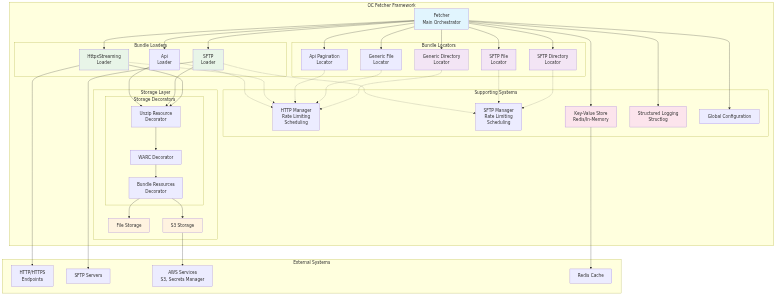
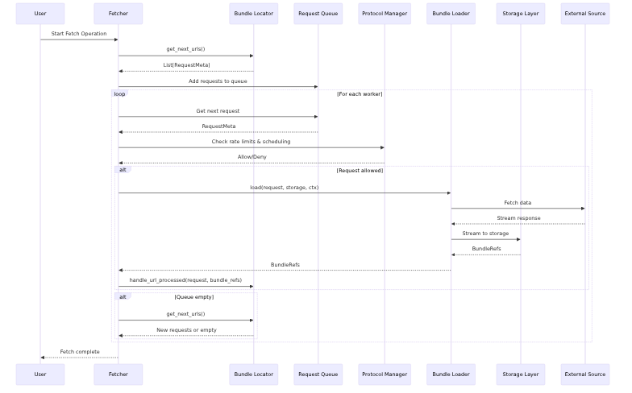
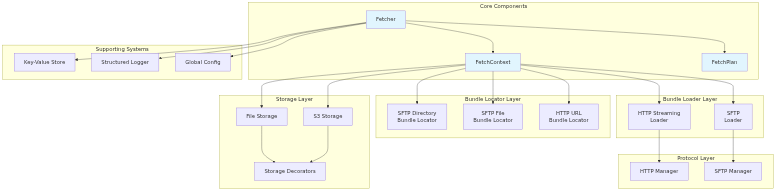

# High-Level Architecture

The OC Fetcher framework coordinates three main components: **Bundle Locators**, **Bundle Loaders**, and **Storage**. The main `Fetcher` class orchestrates these components in a two-phase pipeline, with **Protocol Managers** handling cross-cutting concerns like rate limiting and scheduling.

## Visual Architecture Diagrams

The architecture is documented through several diagrams available in the `../diagrams/` directory:

### High-Level Architecture

The high-level architecture diagram provides an overview of the entire OC Fetcher system, showing how data flows from external sources through various processing layers to final storage. It illustrates the main orchestration flow where the Fetcher coordinates all components in a two-phase pipeline, with supporting systems providing cross-cutting concerns like caching, logging, and configuration management.

**Key Components**:

- **Fetcher** - Main orchestrator that coordinates all components and manages the two-phase pipeline
- **Bundle Locators** - Generate URLs for processing (SFTP Directory/File, Generic Directory/File, API Pagination bundle locators)
- **Bundle Loaders** - Fetch data from endpoints and stream to storage (HttpxStreaming, SFTP, API loaders)
- **Storage Layer** - Composable storage with decorators for data transformation and base implementations
- **Supporting Systems** - Cross-cutting concerns including:
  - **Protocol Managers** - Handle connection management, rate limiting, and scheduling (HTTP/SFTP managers)
  - **Key-Value Store** - Provides caching and state management (Redis/In-Memory)
  - **Structured Logging** - Built-in structlog integration with context variables and JSON output
  - **Application Configuration** - System-wide configuration management for all components

### Data Flow Sequence

The data flow sequence diagram shows the step-by-step process of how a fetch operation works, from initial user request through data loading, storage, and completion. It illustrates the concurrent worker model where multiple workers process requests from a shared queue, with coordination mechanisms to prevent race conditions and ensure proper completion when no more work is available.

**Key Components**:

- **User** - Initiates fetch operations and receives completion notifications
- **Fetcher** - Main orchestrator that manages the entire fetch process
- **Bundle Locator** - Generates URLs to be processed and handles completion callbacks
- **Request Queue** - Thread-safe queue that holds pending requests for worker processing
- **Protocol Manager** - Provides rate limiting and scheduling services used by both locators and loaders
- **Bundle Loader** - Fetches data from external sources and streams to storage
- **Storage Layer** - Persists fetched data with streaming support and metadata management
- **External Source** - Remote endpoints (HTTP/HTTPS, SFTP servers) that provide the data

### Component Relationships

The component relationships diagram provides a detailed view of how all components interact with each other, organized by functional layers. It shows the dependencies between components and how data flows through the system, from the core orchestration layer down to the supporting infrastructure components.

**Key Components**:

- **Core Layer** - Fetcher, Context, and Plan components that orchestrate the entire system
- **Bundle Locators Layer** - Bundle Locators that generate URLs (SFTP Directory/File, Generic Directory/File, API Pagination bundle locators)
- **Loader Layer** - Bundle Loaders that fetch data from endpoints (HttpxStreaming, SFTP, API)
- **Storage Layer** - Base storage implementations and decorators for data transformation
- **Supporting Systems** - Cross-cutting concerns including protocol management, caching, logging, and configuration

These diagrams are available in both PNG and SVG formats in the `../diagrams/` directory for different use cases.

## Architecture Overview

The OC Fetcher framework is built around a composable, streaming-first architecture that coordinates three main components: **Bundle Locators**, **Bundle Loaders**, and **Storage**. The main `Fetcher` class orchestrates these components in a two-phase pipeline, with **Protocol Managers** handling cross-cutting concerns like rate limiting and scheduling.

### Core Architecture Principles

#### 1. **Composable Design**
- Components can be mixed and matched to create different fetching configurations
- Storage decorators can be stacked for different processing needs
- Protocol managers provide reusable infrastructure services

#### 2. **Streaming-First**
- Data flows through the system without loading entire files into memory
- Bundle loaders stream large payloads directly to storage

#### 3. **Protocol Independence**
- Managers handle protocol-specific concerns (rate limiting, scheduling)
- Loaders focus on data fetching and streaming
- Locators generate URLs regardless of the underlying protocol

#### 4. **Extensibility**
- New locators, bundle loaders, and storage backends can be easily added
- Supporting systems provide cross-cutting concerns
- Configuration system allows easy setup of common patterns

### Architecture Components

#### **Core Orchestration**
- **Fetcher**: Main orchestrator that coordinates all components
- **FetchContext**: Configuration and state management
- **FetchPlan**: Execution plan with concurrency settings

#### **Frontier Layer**
- **Bundle Locators**: Generate URLs for processing
  - SFTP Directory/File Locators
  - Generic Directory/File Locators
  - API Pagination Locators

#### **Loader Layer**
- **Bundle Loaders**: Fetch data from endpoints
  - HttpxStreamingLoader for HTTP/HTTPS
  - SFTPLoader for SFTP
  - ApiLoader for API endpoints

#### **Storage Layer**
- **Base Storage**: File Storage and Pipeline Storage
- **Storage Decorators**: Unzip, Bundle Resources

#### **Supporting Systems**
- **Protocol Managers**: Rate limiting and scheduling
- **Key-Value Store**: Caching and state management
- **Structured Logging**: Context variables and JSON output
- **Application Configuration**: System-wide settings
