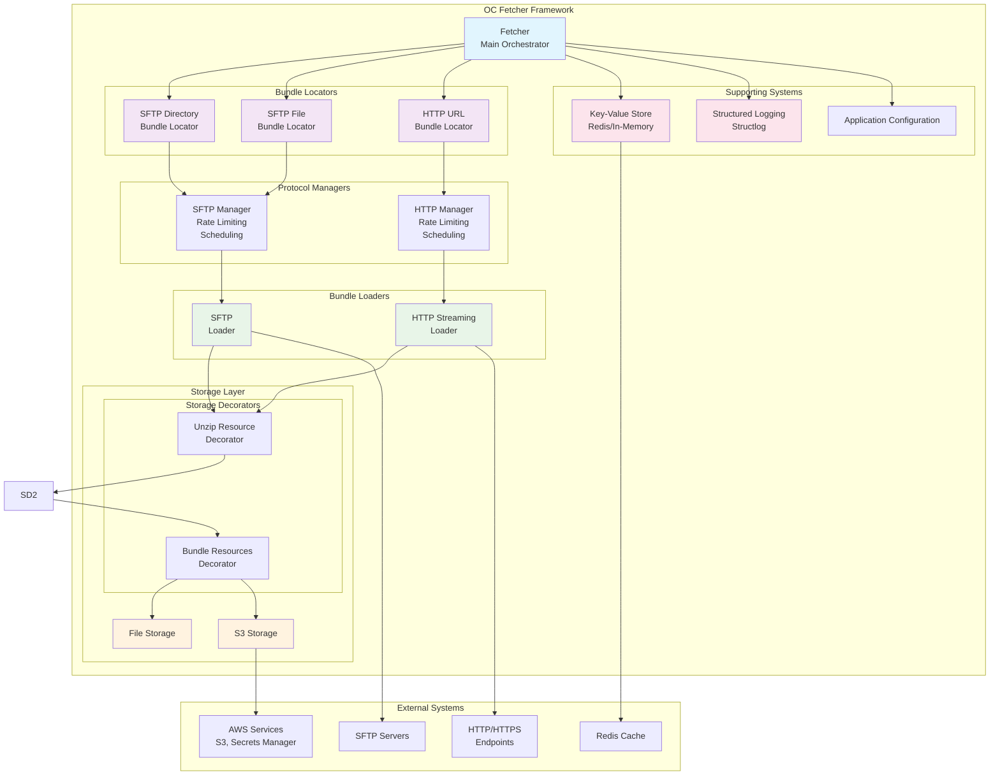
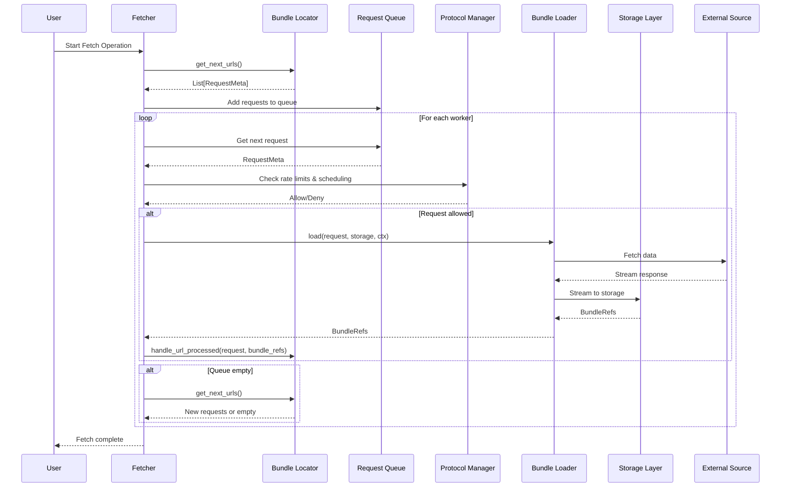
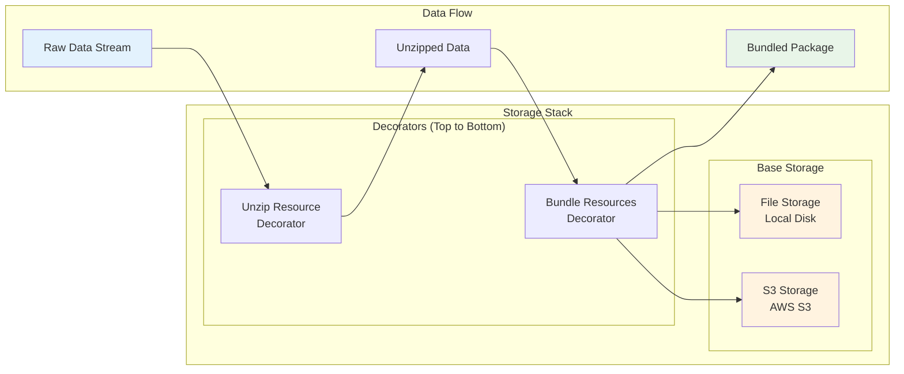
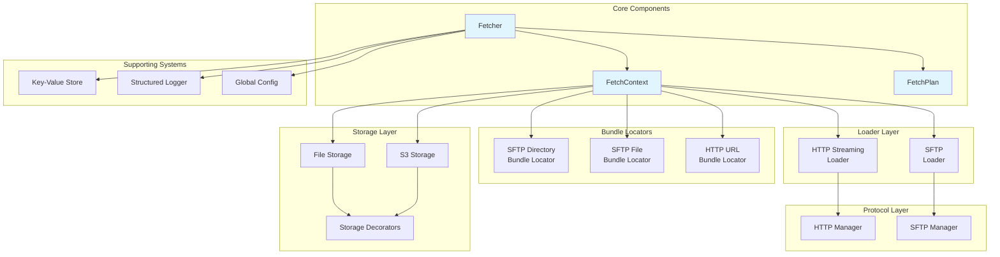

# Architecture Overview

The OC Fetcher framework is built around a composable, streaming-first architecture that coordinates three main components: **Bundle Locators**, **Bundle Loaders**, and **Storage**. The main `Fetcher` class orchestrates these components in a two-phase pipeline, with **Protocol Managers** handling cross-cutting concerns like rate limiting and scheduling.

## Core Architecture Principles

### 1. **Composable Design**
- Components can be mixed and matched to create different fetching configurations
- Storage decorators can be stacked for different processing needs
- Protocol managers provide reusable infrastructure services

### 2. **Streaming-First**
- Data flows through the system without loading entire files into memory
- Bundle loaders stream large payloads directly to storage


### 3. **Protocol Independence**
- Managers handle protocol-specific concerns (rate limiting, scheduling)
- Loaders focus on data fetching and streaming
- Locators generate URLs regardless of the underlying protocol

### 4. **Extensibility**
- New locators, bundle loaders, and storage backends can be easily added
- Supporting systems provide cross-cutting concerns
- Configuration system allows easy setup of common patterns

## Architecture Components

### **Core Orchestration**
- **Fetcher**: Main orchestrator that coordinates all components
- **FetchContext**: Configuration and state management
- **FetchPlan**: Execution plan with concurrency settings

### **Frontier Layer**
- **Bundle Locators**: Generate URLs for processing
  - SFTP Directory/File Locators
  - Generic Directory/File Locators
  - API Pagination Locators

### **Loader Layer**
- **Bundle Loaders**: Fetch data from endpoints
  - HttpxStreamingLoader for HTTP/HTTPS
  - SFTPLoader for SFTP
  - ApiLoader for API endpoints

### **Storage Layer**
- **Base Storage**: File Storage and S3 Storage
- **Storage Decorators**: Unzip, Bundle Resources

### **Supporting Systems**
- **Protocol Managers**: Rate limiting and scheduling
- **Key-Value Store**: Caching and state management
- **Structured Logging**: Context variables and JSON output
- **Application Configuration**: System-wide settings

## Core Orchestration Flow

The fetcher coordinates components in a two-phase pipeline with concurrent workers and proper completion coordination:

### Phase 1: URL Generation
1. **Fetcher** creates a `FetchPlan` with execution context
2. **Bundle Locators** generate URLs and add them to a thread-safe queue
3. **Protocol Managers** provide rate limiting and scheduling services
4. Multiple workers process URLs concurrently from the shared queue

### Phase 2: Data Loading
1. **Bundle Loaders** fetch data from endpoints using protocol managers
2. Data is streamed directly to **Storage** without loading into memory
3. **Storage Decorators** transform data (Unzip → Bundle)
4. Workers coordinate shutdown when no more URLs are available

### Key Features
- **Concurrent Processing**: Multiple workers process requests simultaneously
- **Queue-Based URL Generation**: New URLs are generated only when the queue is empty
- **Thread-Safe Coordination**: Proper locking prevents race conditions
- **Completion Coordination**: Workers coordinate shutdown when no more URLs are available
- **URL Processing Callbacks**: Frontier providers are notified when URLs are successfully processed

## Component Interactions

### Bundle Locators
- Generate URLs for processing based on configuration
- Handle completion callbacks to track processed URLs
- Support different patterns: directory scanning, file lists, API pagination

### Bundle Loaders
- Fetch data from endpoints using appropriate protocols
- Stream large payloads directly to storage
- Handle protocol-specific concerns through managers

### Protocol Managers
- Provide rate limiting and scheduling services
- Handle connection management and authentication
- Support different protocols: HTTP/HTTPS, SFTP

### Storage System
- **Base Storage**: File system and S3 implementations
- **Decorators**: Transform data during streaming
  - Unzip: Extract compressed files
  
  - Bundle: Group related resources

## Storage Architecture

The storage system uses a composable design with decorators:

```
Data Source → Unzip Decorator → Bundle Decorator → Base Storage
```

### Storage Decorators
- **Unzip**: Automatically extracts compressed files during streaming

- **Bundle**: Groups related resources into logical bundles

### Base Storage
- **File Storage**: Local file system storage
- **S3 Storage**: AWS S3 integration with streaming support

## Configuration System

The framework uses a registry-based configuration system:

```python
from data_fetcher.registry import get_fetcher

# Get a configured fetcher
fetcher = get_fetcher("us-fl")  # SFTP configuration
fetcher = get_fetcher("fr")     # API configuration
```

### Available Configurations
- **`us-fl`**: US Florida SFTP batch processing
- **`fr`**: France API fetcher with pagination

## Error Handling and Resilience

### Error Handling
- Protocol managers handle connection errors and retries
- Bundle loaders handle HTTP status codes and network issues
- Storage decorators handle data corruption and format errors

### Resilience Features
- Automatic retry with exponential backoff
- Graceful degradation for non-critical errors
- Comprehensive logging for debugging and monitoring

## Performance Considerations

### Memory Efficiency
- Streaming architecture prevents large files from loading into memory
- Concurrent processing maximizes throughput
- Efficient queue management reduces memory overhead

### Scalability
- Horizontal scaling through multiple worker processes
- Configurable concurrency levels
- Protocol-level rate limiting prevents overwhelming sources

## Development and Extension

### Adding New Protocols
1. Implement a new Protocol Manager
2. Create corresponding Bundle Loader
3. Register configuration in the registry

### Adding New Storage Backends
1. Implement Base Storage interface
2. Create storage decorators as needed
3. Configure through global storage system

### Adding New Locators
1. Implement Bundle Locator interface
2. Handle URL generation and completion callbacks
3. Register in configuration setup

## Architecture Documentation

### [Core Orchestration Flow](core_orchestration_flow.md)
Learn how the fetcher coordinates components in a two-phase pipeline with concurrent workers and proper completion coordination.

### [Component Interactions](component_interactions.md)
Detailed interfaces and relationships between Bundle Locators, Bundle Loaders, Protocol Managers, and Storage components.

### [High-Level Architecture](high_level_architecture.md)
System overview showing how data flows from external sources through processing layers to final storage, with supporting systems providing cross-cutting concerns.

### [Storage Architecture](storage_architecture.md)
Composable storage system with decorators for data transformation (Unzip → Bundle) before reaching base storage implementations.

### [Component Relationships](component_relationships.md)
Detailed view of component interactions organized by functional layers, showing dependencies and data flow through the system.

## Architecture Diagrams

### High-Level Architecture



### Data Flow Sequence



### Storage Architecture



### Component Relationships



## Generated Images

The diagrams have been converted to PNG and SVG images and are available in the `docs/diagrams/` directory:

### PNG Images (High Quality)
- [High Level Architecture](../diagrams/png/high_level_architecture.png)
- [Data Flow Sequence](../diagrams/png/data_flow_sequence.png)
- [Storage Architecture](../diagrams/png/storage_architecture.png)
- [Component Relationships](../diagrams/png/component_relationships.png)

### SVG Images (Scalable Vector Graphics)
- [High Level Architecture](../diagrams/svg/high_level_architecture.svg)
- [Data Flow Sequence](../diagrams/svg/data_flow_sequence.svg)
- [Storage Architecture](../diagrams/svg/storage_architecture.svg)
- [Component Relationships](../diagrams/svg/component_relationships.svg)

## Key Architectural Features

- **Concurrent Processing**: Multiple workers process requests simultaneously
- **Queue-Based URL Generation**: New URLs are generated only when the queue is empty
- **Thread-Safe Coordination**: Proper locking prevents race conditions
- **Completion Coordination**: Workers coordinate shutdown when no more URLs are available
- **URL Processing Callbacks**: Bundle locators are notified when URLs are successfully processed
- **Protocol-Level Rate Limiting**: Rate limiting is handled at the protocol level for better performance
- **Scheduling Support**: Built-in support for daily and interval-based scheduling
