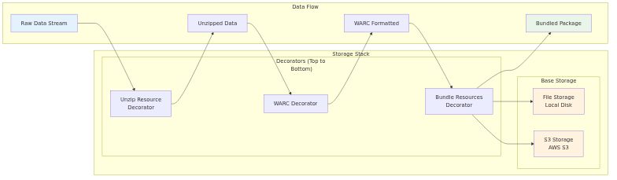

# Storage Architecture

The framework uses a composable storage architecture with two base storage implementations and three decorators. The storage system is designed to be streaming-first, allowing large payloads to be processed without loading entire files into memory.

## Visual Architecture Diagram



The storage architecture diagram focuses on the composable storage system, showing how data transforms as it flows through different decorators before reaching the final storage destination. It illustrates the decorator pattern where each decorator adds specific functionality (unzipping, bundling) while maintaining the same storage interface.

**Key Components**:

- **Raw Data Stream** - Initial data received from remote sources (may be compressed)
- **Unzip Resource Decorator** - Automatically decompresses gzip and zip resources before processing

- **Bundle Resources Decorator** - Collects all resources in a bundle and creates a single zip file
- **File Storage** - Stores files on local disk with custom output directory support
- **Pipeline Storage** - Stores files in AWS S3 with metadata and environment-specific bucket naming

## Base Storage Implementations

### 1. **FileStorage** (`data_fetcher/storage/file_storage.py`)
- Stores files on local disk
- Simple file-based persistence
- Supports custom output directories
- No external dependencies

### 2. **PipelineStorage** (`data_fetcher/storage/pipeline_storage.py`)
- Stores files in S3 with metadata
- Direct S3 upload with metadata
- Supports environment-specific bucket naming
- Requires boto3 and AWS credentials

## Storage Decorators

Storage decorators are located in `data_fetcher/storage/decorators/` and modify streams being passed to storage implementations:

### 1. **UnzipResourceDecorator** (`unzip_resource.py`)
- Automatically decompresses gzip and zip resources
- Handles common compression formats
- Preserves original file structure


### 3. **BundleResourcesDecorator** (`bundle_resources.py`)
- Collects all resources in a bundle and creates a single zip file
- Provides convenient packaging for downstream processing
- Maintains resource relationships

## Storage Interface

The storage system implements a consistent interface:

```python
Storage Interface:
- open_bundle(bundle_id, metadata) -> Stream
  - Creates a new bundle for writing data
  - Returns a writable stream for the bundle
  - Handles metadata storage and organization

- close_bundle(stream) -> None
  - Finalizes the bundle and commits data
  - Ensures data is properly persisted
```

## Usage Examples

### Basic File Storage
```python
from data_fetcher_core.storage import FileStorage

# Basic file storage
storage = FileStorage("output/files")
```


### Pipeline Storage with Resource Bundling
```python
from data_fetcher_core.storage import PipelineStorage, BundleResourcesDecorator

# Pipeline storage with resource bundling
base_storage = PipelineStorage("my-bucket", "prefix/")
storage = BundleResourcesDecorator(base_storage)
```

### Complex Storage Stack
```python
from data_fetcher_core.storage import FileStorage, create_storage_stack

# Complex storage stack with all decorators
base_storage = FileStorage("output/complex")
storage = create_storage_stack(
    base_storage=base_storage,

    bundle_resources=True,
    unzip_resources=True,
)
```

## Data Flow Through Storage

1. **Raw Data**: Initial data received from bundle loaders
2. **Unzip Decorator**: Decompresses any compressed resources

4. **Bundle Decorator**: Packages resources into a single bundle
5. **Base Storage**: Persists the final bundle to disk or S3

## Key Features

- **Streaming Support**: Data flows through decorators without loading into memory
- **Composable Design**: Decorators can be mixed and matched as needed
- **Protocol Independence**: Same storage interface regardless of source protocol
- **Metadata Preservation**: All metadata is preserved through the storage chain
- **Extensible**: New storage backends and decorators can be easily added
