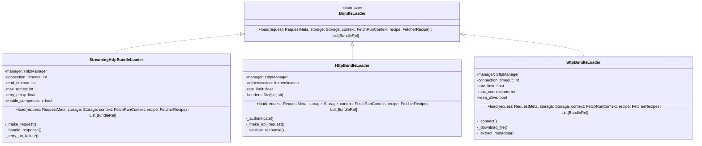

# Loaders

Bundle Loaders are responsible for fetching data from endpoints and streaming it to storage. They implement the `BundleLoader` protocol and handle the actual data retrieval process, including authentication, rate limiting, and error handling.

## What are Loaders?

Loaders are components that:
- **Fetch Data**: Retrieve data from remote endpoints
- **Stream Content**: Stream large payloads directly to storage without loading into memory
- **Handle Protocols**: Support different protocols (HTTP, SFTP, etc.)
- **Manage Connections**: Handle connection management and authentication
- **Apply Rate Limiting**: Respect rate limits and scheduling constraints

## Loader Interface

All loaders implement the `BundleLoader` protocol:

```python
class BundleLoader(Protocol):
    async def load(
        self,
        request: RequestMeta,
        storage: Storage,
        context: FetchRunContext,
        recipe: FetcherRecipe
    ) -> List[BundleRef]:
        """Fetch data from the request URL and stream to storage using BundleStorageContext."""
        pass
```

The new interface uses `BundleStorageContext` for managing bundle lifecycle:

```python
# Loader implementation pattern
async def load(self, request: RequestMeta, storage: Storage, ctx: FetchRunContext, recipe: FetcherRecipe) -> List[BundleRef]:
    # Create bundle reference
    bundle_ref = BundleRef(primary_url=request.url, resources_count=1)

    # Start bundle and get context
    bundle_context = await storage.start_bundle(bundle_ref, recipe)

    try:
        # Add resources to bundle
        await bundle_context.add_resource(url, content_type, status_code, stream)

        # Complete bundle (triggers callbacks and SQS notifications)
        await bundle_context.complete(metadata)

    except Exception as e:
        # BundleStorageContext handles cleanup
        raise

    return [bundle_ref]
```

## Available Loaders

### **HTTP Loaders**

#### **StreamingHttpBundleLoader**
High-performance HTTP/HTTPS loader with streaming support.

**Features:**
- Streaming responses for large files
- HTTP/2 support
- Connection pooling
- Automatic retry with exponential backoff
- Request/response compression
- Timeout handling

**Example Configuration:**
```python
# Create protocol configuration
http_config = create_http_protocol_config(
    timeout=30.0,
    rate_limit_requests_per_second=10.0,
    max_retries=3
)

# Create loader with ProtocolConfig
loader = create_http_bundle_loader(
    http_config=http_config,
    meta_load_name="streaming_http_loader"
)
```

#### **HttpBundleLoader**
Specialized loader for API endpoints with authentication support.

**Features:**
- OAuth authentication
- API-specific error handling
- Response validation
- Rate limiting compliance
- Custom headers support

**Example Configuration:**
```python
# Create protocol configuration with authentication
http_config = create_http_protocol_config(
    timeout=30.0,
    rate_limit_requests_per_second=10.0,
    max_retries=3,
    authentication_mechanism=OAuthAuthentication(
        client_id="your_client_id",
        client_secret="your_client_secret"
    )
)

# Create loader with ProtocolConfig
loader = create_tracking_http_bundle_loader(
    http_config=http_config,
    meta_load_name="api_loader"
)
```

### **SFTP Loaders**

#### **SftpBundleLoader**
Enterprise-grade SFTP loader with AWS integration.

**Features:**
- SSH key and password authentication
- Connection pooling
- File streaming
- Metadata extraction
- Error handling and retry logic

**Example Configuration:**
```python
# Create protocol configuration
sftp_config = create_sftp_protocol_config(
    config_name="example_sftp",
    connect_timeout=20.0,
    rate_limit_requests_per_second=2.0,
    max_retries=3
)

# Create loader with ProtocolConfig
loader = create_sftp_loader(
    sftp_config=sftp_config,
    meta_load_name="sftp_loader"
)
```

## Loader Class Hierarchy



## Loader Lifecycle

### **1. Initialization**
- Loaders are created with their configuration
- Protocol managers are configured for network operations
- Connection pools are established

### **2. Request Processing**
- `load()` is called with a request, storage, and context
- Loaders establish connections to remote endpoints
- Data is fetched and streamed to storage

### **3. Data Streaming**
- Large payloads are streamed directly to storage
- No intermediate buffering in memory
- Metadata is extracted and preserved

### **4. Completion**
- Bundle references are returned
- Connections are managed (kept alive or closed)
- Error handling and retry logic is applied

## Loader Configuration

### **Common Configuration Options**

#### **Timeouts**
```python
loader = StreamingHttpBundleLoader(
    connection_timeout=30,  # Connection establishment timeout
    read_timeout=300,       # Data reading timeout
    manager=http_manager
)
```

#### **Retry Logic**
```python
loader = StreamingHttpBundleLoader(
    max_retries=3,          # Maximum retry attempts
    retry_delay=1.0,        # Initial retry delay
    manager=http_manager
)
```

#### **Rate Limiting**
```python
loader = SftpBundleLoader(
    rate_limit=2.0,         # Requests per second
    manager=sftp_manager
)
```

### **Protocol-Specific Configuration**

#### **HTTP Configuration**
```python
loader = StreamingHttpBundleLoader(
    manager=http_manager,
    connection_timeout=30,
    read_timeout=300,
    max_retries=3,
    retry_delay=1.0,
    enable_compression=True,
    headers={
        "User-Agent": "OC-Fetcher/1.0",
        "Accept": "application/json"
    }
)
```

#### **SFTP Configuration**
```python
loader = SftpBundleLoader(
    manager=sftp_manager,
    connection_timeout=20,
    rate_limit=2.0,
    max_connections=5,
    keep_alive=True,
    compression=True
)
```

#### **API Configuration**
```python
loader = HttpBundleLoader(
    manager=http_manager,
    authentication=OAuthAuthentication(
        client_id="your_client_id",
        client_secret="your_client_secret",
        token_url="https://api.example.com/oauth/token"
    ),
    rate_limit=10.0,
    headers={
        "User-Agent": "OC-Fetcher/1.0",
        "Accept": "application/json"
    }
)
```

## Loader Examples

### **US Florida SFTP Loader**
```python
class USFloridaSftpBundleLoader(SftpBundleLoader):
    def __init__(self, credentials: SFTPCredentials):
        super().__init__(
            manager=sftp_manager,
            connection_timeout=20,
            rate_limit=2.0,
            max_connections=5,
            keep_alive=True
        )
        self.credentials = credentials
```

### **France API Loader**
```python
class FranceAPILoader(HttpBundleLoader):
    def __init__(self, credentials: APICredentials):
        super().__init__(
            manager=http_manager,
            authentication=OAuthAuthentication(
                client_id=credentials.client_id,
                client_secret=credentials.client_secret,
                token_url="https://api.example.com/oauth/token"
            ),
            rate_limit=10.0,
            headers={
                "User-Agent": "OC-Fetcher/1.0",
                "Accept": "application/json"
            }
        )
```

## Data Streaming Process

### **1. Request Preparation**
```python
async def load(self, request: RequestMeta, storage: Storage, context: FetcherContext) -> List[BundleRef]:
    # Prepare request
    url = request.url
    headers = self._prepare_headers(request)
    params = self._prepare_params(request)
```

### **2. Connection Establishment**
```python
    # Establish connection
    async with self.manager.get_client() as client:
        # Make request
        response = await client.get(url, headers=headers, params=params)
```

### **3. Data Streaming**
```python
        # Stream data to storage using BundleStorageContext
        bundle_ref = BundleRef(primary_url=request.url, resources_count=1)
        bundle_context = await storage.start_bundle(bundle_ref, recipe)

        try:
            # Add resource to bundle
            await bundle_context.add_resource(
                url=request.url,
                content_type=response.headers.get("content-type"),
                status_code=response.status_code,
                stream=response.aiter_bytes(chunk_size=8192)
            )

            # Complete bundle
            await bundle_context.complete({"source": "http_loader"})

        except Exception as e:
            # BundleStorageContext handles cleanup
            raise

        bundle_refs = [bundle_ref]
```

### **4. Completion**
```python
        return bundle_refs
```

## Error Handling

### **Network Errors**
```python
try:
    response = await client.get(url)
except httpx.ConnectError:
    # Handle connection errors
    raise LoaderError("Failed to connect to server")
except httpx.TimeoutException:
    # Handle timeout errors
    raise LoaderError("Request timed out")
except httpx.HTTPStatusError as e:
    # Handle HTTP status errors
    if e.response.status_code == 404:
        raise LoaderError("Resource not found")
    elif e.response.status_code == 429:
        raise LoaderError("Rate limit exceeded")
    else:
        raise LoaderError(f"HTTP error: {e.response.status_code}")
```

### **Retry Logic**
```python
async def _retry_on_failure(self, func, *args, **kwargs):
    for attempt in range(self.max_retries):
        try:
            return await func(*args, **kwargs)
        except (httpx.ConnectError, httpx.TimeoutException) as e:
            if attempt == self.max_retries - 1:
                raise
            delay = self.retry_delay * (2 ** attempt)  # Exponential backoff
            await asyncio.sleep(delay)
```

## Performance Optimization

### **Connection Pooling**
```python
class StreamingHttpBundleLoader:
    def __init__(self, manager: HttpManager):
        self.manager = manager
        self._client = None

    async def _get_client(self):
        if self._client is None:
            self._client = httpx.AsyncClient(
                limits=httpx.Limits(max_connections=100, max_keepalive_connections=20),
                timeout=httpx.Timeout(30.0, read=300.0)
            )
        return self._client
```

### **Streaming Optimization**
```python
async def _stream_to_storage(self, response, storage, bundle_id):
    async with storage.open_bundle(bundle_id) as bundle:
        async for chunk in response.aiter_bytes(chunk_size=8192):
            await bundle.write(chunk)
            # No intermediate buffering
```

## Creating Custom Loaders

### **1. Implement BundleLoader Protocol**
```python
from data_fetcher_core.loaders import BundleLoader
from data_fetcher_core.types import RequestMeta, BundleRef, FetcherContext

class MyCustomLoader:
    async def load(
        self,
        request: RequestMeta,
        storage: Storage,
        context: FetcherContext
    ) -> List[BundleRef]:
        # Implement data fetching logic
        pass
```

### **2. Add Protocol-Specific Logic**
```python
class MyCustomLoader:
    def __init__(self, manager: ProtocolManager):
        self.manager = manager

    async def load(self, request: RequestMeta, storage: Storage, context: FetcherContext) -> List[BundleRef]:
        # Use protocol manager for connection management
        async with self.manager.get_client() as client:
            # Implement custom protocol logic
            pass
```

### **3. Add Error Handling**
```python
class MyCustomLoader:
    async def load(self, request: RequestMeta, storage: Storage, context: FetcherContext) -> List[BundleRef]:
        try:
            # Implementation
            pass
        except CustomProtocolError as e:
            raise LoaderError(f"Custom protocol error: {e}")
```

## Best Practices

### **Performance**
- Use streaming for large files to avoid memory issues
- Implement connection pooling for better performance
- Use appropriate chunk sizes for streaming

### **Error Handling**
- Implement comprehensive error handling
- Use retry logic for transient failures
- Provide meaningful error messages

### **Security**
- Handle authentication securely
- Validate SSL certificates
- Sanitize input parameters

### **Testing**
- Test with mock endpoints
- Validate streaming behavior
- Test error conditions
- Verify retry logic

## Next Steps

- **[Storage](../storage/README.md)** - Learn about data persistence
- **[State Management](../state_management/README.md)** - Understand state management
- **[Orchestration](../orchestration/README.md)** - Learn how loaders fit into the overall system
- **[Recipes](../recipes/README.md)** - Understand how loaders are configured
