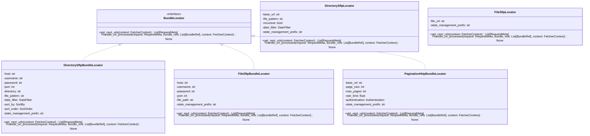

# Locators

Bundle Locators are the frontier layer of the OC Fetcher framework. They are responsible for generating URLs that need to be processed, discovering new resources, and tracking completion status. Locators implement the `BundleLocator` protocol and provide a standardized interface for URL generation across different protocols and data sources.

## What are Locators?

Locators are components that:
- **Generate URLs**: Discover and provide URLs for processing
- **Track Progress**: Monitor which URLs have been processed
- **Handle Completion**: Update their state when URLs are successfully processed
- **Support Discovery**: Continuously find new resources as needed

## Locator Interface

All locators implement the `BundleLocator` protocol:

```python
class BundleLocator(Protocol):
    async def get_next_urls(self, context: FetcherContext) -> List[RequestMeta]:
        """Generate and return next URLs to be processed."""
        pass

    async def handle_url_processed(
        self,
        request: RequestMeta,
        bundle_refs: List[BundleRef],
        context: FetcherContext
    ) -> None:
        """Called when a URL has been successfully processed."""
        pass
```

## Available Locators

### **SFTP Locators**

#### **DirectorySftpBundleLocator**
Scans SFTP directories for files matching specific patterns.

**Features:**
- Directory scanning with pattern matching
- Date-based filtering
- Sorting by modification time or name
- State management for tracking processed files

**Example Configuration:**
```python
# Create protocol configuration
sftp_config = create_sftp_protocol_config(
    config_name="example_sftp",
    connect_timeout=20.0,
    rate_limit_requests_per_second=2.0
)

# Create locator with ProtocolConfig
locator = create_directory_provider(
    sftp_config=sftp_config,
    remote_dir="/data/files/",
    filename_pattern="*.txt",
    file_filter=DateFilter(start_date="2023-01-01"),
    sort_key=SortBy.MODIFICATION_TIME,
    sort_reverse=True,
)
```

#### **FileSftpBundleLocator**
Processes individual files from SFTP servers.

**Features:**
- Single file processing
- File existence validation
- Metadata extraction

**Example Configuration:**
```python
# Create protocol configuration
sftp_config = create_sftp_protocol_config(
    config_name="example_sftp",
    connect_timeout=20.0,
    rate_limit_requests_per_second=2.0
)

# Create locator with ProtocolConfig
locator = create_file_provider(
    sftp_config=sftp_config,
    file_paths=["/data/specific_file.txt"],
)
```


### **API Locators**

#### **PaginationHttpBundleLocator**
Handles API endpoints with pagination support.

**Features:**
- Automatic pagination handling
- Rate limiting compliance
- Authentication support
- Response parsing

**Example Configuration:**
```python
# Create protocol configuration
http_config = create_http_protocol_config(
    timeout=30.0,
    rate_limit_requests_per_second=10.0,
    max_retries=3,
    authentication_mechanism=OAuthAuthentication(
        client_id="your_client_id",
        client_secret="your_client_secret"
    )
)

# Create locator with ProtocolConfig
locator = create_api_pagination_provider(
    http_config=http_config,
    store=kv_store,
    base_url="https://api.example.com/data",
    date_start="2023-01-01",
    max_records_per_page=100,
    state_management_prefix="api_pagination_provider"
)
```

## Locator Class Hierarchy



## Locator Lifecycle

### **1. Initialization**
- Locators are created with their configuration
- State management is set up for tracking processed URLs
- Protocol managers are configured for network operations

### **2. URL Generation**
- `get_next_urls()` is called to discover new URLs
- Locators scan their data sources (directories, APIs, etc.)
- URLs are filtered and sorted according to configuration
- Processed URLs are excluded from results

### **3. Processing**
- URLs are added to the processing queue
- Workers process URLs concurrently
- Locators are notified when URLs are completed

### **4. Completion Tracking**
- `handle_url_processed()` is called for each completed URL
- Locators update their state management state
- New URLs may be generated based on completion

## Locator Configuration

### **Common Configuration Options**

#### **State Management**
All locators support state management for tracking processed URLs:

```python
locator = DirectorySftpBundleLocator(
    # ... other configuration ...
    state_management_prefix="my_locator"  # Unique prefix for this locator
)
```

#### **Date Filtering**
Many locators support date-based filtering:

```python
from data_fetcher_core.filters import DateFilter

date_filter = DateFilter(
    start_date="2023-01-01",
    end_date="2023-12-31",
    date_format="%Y-%m-%d"
)

locator = DirectorySftpBundleLocator(
    # ... other configuration ...
    date_filter=date_filter
)
```

#### **Sorting**
Directory-based locators support sorting:

```python
from data_fetcher_core.sorting import SortBy, SortOrder

locator = DirectorySftpBundleLocator(
    # ... other configuration ...
    sort_by=SortBy.MODIFICATION_TIME,
    sort_order=SortOrder.DESCENDING
)
```

### **Protocol-Specific Configuration**

#### **SFTP Configuration**
```python
locator = DirectorySftpBundleLocator(
    host="sftp.example.com",
    username="user",
    password="pass",
    port=22,
    directory="/data/files/",
    file_pattern="*.txt",
    connection_timeout=30,
    rate_limit=5.0
)
```

#### **HTTP/API Configuration**
```python
locator = PaginationHttpBundleLocator(
    base_url="https://api.example.com/data",
    page_size=100,
    max_pages=1000,
    rate_limit=10.0,
    authentication=OAuthAuthentication(
        client_id="your_client_id",
        client_secret="your_client_secret"
    ),
    headers={"User-Agent": "OC-Fetcher/1.0"}
)
```

## Locator Examples

### **US Florida Daily Provider**
```python
class USFloridaDailyProvider(DirectorySftpBundleLocator):
    def __init__(self, credentials: SFTPCredentials):
        super().__init__(
            host=credentials.host,
            username=credentials.username,
            password=credentials.password,
            port=credentials.port,
            directory="/doc/cor/",
            file_pattern="*.txt",
            date_filter=DateFilter(start_date="2023-07-28"),
            sort_by=SortBy.MODIFICATION_TIME,
            sort_order=SortOrder.DESCENDING,
            state_management_prefix="us_fl_daily_provider"
        )
```

### **France API Provider**
```python
class FranceAPIProvider(PaginationHttpBundleLocator):
    def __init__(self, credentials: APICredentials):
        super().__init__(
            base_url="https://api.example.com/siren",
            page_size=100,
            max_pages=1000,
            rate_limit=10.0,
            authentication=OAuthAuthentication(
                client_id=credentials.client_id,
                client_secret=credentials.client_secret
            ),
            state_management_prefix="fr_api_provider"
        )
```

## Creating Custom Locators

### **1. Implement BundleLocator Protocol**
```python
from data_fetcher_core.locators import BundleLocator
from data_fetcher_core.types import RequestMeta, BundleRef, FetcherContext

class MyCustomLocator:
    async def get_next_urls(self, context: FetcherContext) -> List[RequestMeta]:
        # Implement URL generation logic
        pass

    async def handle_url_processed(
        self,
        request: RequestMeta,
        bundle_refs: List[BundleRef],
        context: FetcherContext
    ) -> None:
        # Implement completion handling
        pass
```

### **2. Add State Management Support**
```python
class MyCustomLocator:
    def __init__(self, state_management_prefix: str):
        self.state_management_prefix = state_management_prefix

    async def _is_url_processed(self, url: str, context: FetchRunContext) -> bool:
        key = f"{self.state_management_prefix}:processed:{url}"
        store = context.app_config.kv_store
        return await store.exists(key)

    async def _mark_url_processed(self, url: str, context: FetchRunContext):
        key = f"{self.state_management_prefix}:processed:{url}"
        store = context.app_config.kv_store
        await store.set(key, "true", ttl=86400)
```

### **3. Add Configuration Options**
```python
class MyCustomLocator:
    def __init__(
        self,
        base_url: str,
        file_pattern: str = "*",
        max_files: int = 1000,
        state_management_prefix: str = "custom_locator"
    ):
        self.base_url = base_url
        self.file_pattern = file_pattern
        self.max_files = max_files
        self.state_management_prefix = state_management_prefix
```

## Best Practices

### **Performance**
- Use appropriate rate limiting to avoid overwhelming data sources
- Implement efficient filtering to reduce unnecessary processing
- Cache results when possible to avoid repeated network calls

### **Error Handling**
- Handle network errors gracefully
- Implement retry logic for transient failures
- Provide meaningful error messages

### **State Management**
- Use unique state management prefixes for each locator instance
- Set appropriate TTL values for processed URL tracking
- Handle state management failures gracefully

### **Testing**
- Test with mock data sources
- Validate URL generation logic
- Test completion handling
- Verify state management behavior

## Next Steps

- **[Loaders](../loaders/README.md)** - Learn about data fetching components
- **[Storage](../storage/README.md)** - Understand data persistence
- **[State Management](../state_management/README.md)** - Learn about state management
- **[Orchestration](../orchestration/README.md)** - Understand how locators fit into the overall system
