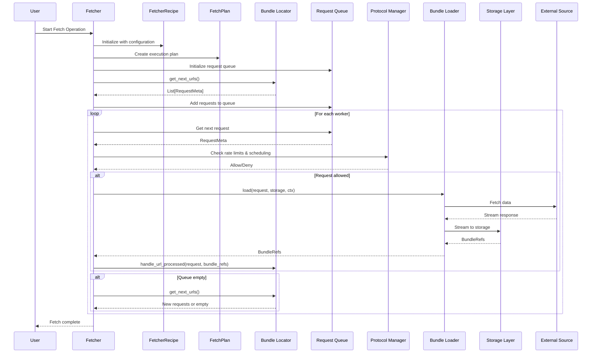
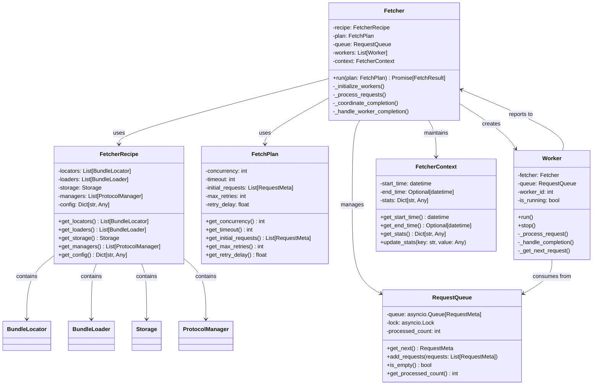

# Orchestration

The orchestration layer is the heart of the OC Fetcher framework. It coordinates all components through a sophisticated two-phase pipeline that manages concurrent processing, URL generation, and data fetching.

## Core Orchestration Components

### **Fetcher**
The main orchestrator that coordinates all components and manages the two-phase pipeline.

### **FetcherRecipe**
Configuration and state management for all components, including locators, loaders, and storage.

### **FetchPlan**
Execution plan with concurrency settings and request metadata.

## Two-Phase Pipeline Architecture

The fetcher operates with multiple workers processing URLs concurrently from a persistent, durable queue. The main `Fetcher` class orchestrates these components through a continuous loop between two phases: **Bundle Locating** and **Bundle Downloading**.

> **Note**: The fetcher now uses a persistent queue backed by the key-value store, enabling resumable operations across application restarts. See the [Persistent Queue System](../queue/README.md) documentation for detailed information.

### **Phase 1: Bundle Locating**
- Get URLs from bundle locators via `get_next_urls()`
- Add discovered URLs to the processing queue
- This phase occurs during initialization and after each request is processed

### **Phase 2: Bundle Downloading**
- Process requests from the queue
- Call `bundle_loader.load()` to fetch data and stream to storage using BundleStorageContext
- Execute completion callbacks from loaders and locators
- Send SQS notifications for bundle completion
- Notify bundle locators of completed requests via `handle_url_processed()`

## Detailed Orchestration Flow

### INITIALIZATION:
1. **Setup coordination**:
   - Create persistent request queue using KV store (requires kv_store in app_config)
   - Setup completion coordination mechanisms
   - Call storage `on_run_start` hook to process pending completions

2. **Initial Bundle Locating** (Phase 1):
   - Get initial URLs from all bundle locators
   - Add discovered URLs to the processing queue
   - Add any initial requests from the fetch plan

3. **Start workers**:
   - Create multiple workers based on concurrency setting
   - Each worker processes requests from the shared queue

### WORKER PROCESSING LOOP:
Each worker runs independently and continuously loops between the two phases:

1. **Bundle Downloading** (Phase 2):
   - Get next request from persistent queue
   - Call `bundle_loader.load()` to fetch data and stream to storage using BundleStorageContext
   - Execute completion callbacks from loaders and locators
   - Send SQS notifications for bundle completion
   - Notify bundle locators of completed requests

2. **Bundle Locating** (Phase 1) - After each request:
   - If queue is empty, check for more URLs from bundle locators
   - Add any new URLs to the processing queue
   - If no new URLs found, signal completion

3. **Handle Timeout** (when no requests available):
   - If queue is empty, attempt to get more URLs from bundle locators
   - Add any new URLs to the processing queue
   - If no new URLs found, signal completion

### COMPLETION:
- Workers continue until no more URLs are available
- Process completes when bundle locators have no more URLs to provide
- All workers coordinate graceful shutdown

## Orchestration Sequence Diagram



## Coordination Mechanisms

### **Request Queue**
- Central queue holding pending requests for processing
- Workers process requests concurrently from this shared queue
- New URLs are added during initialization and continuous discovery

### **Completion Coordination**
- Workers coordinate to determine when all work is complete
- Process continues until no new URLs are found during bundle locating
- Graceful shutdown when all available work is finished

## Worker Lifecycle

1. **Start**: Worker begins processing requests from queue
2. **Bundle Downloading**: Worker fetches data and streams to storage, notifies locators of completion
3. **Bundle Locating**: After each request, worker checks if more URLs are needed
4. **Timeout Handling**: If no requests available, worker attempts to get more URLs from locators
5. **Complete**: Worker exits when no more URLs are available

## Component Interactions

### **Bundle Locator Interface**
Bundle locators implement the `BundleLocator` protocol with two main methods:

```python
class BundleLocator(Protocol):
    async def get_next_urls(self, context: FetcherContext) -> List[RequestMeta]:
        """Generate and return next URLs to be processed."""
        pass

    async def handle_url_processed(
        self,
        request: RequestMeta,
        bundle_refs: List[BundleRef],
        context: FetcherContext
    ) -> None:
        """Called when a URL has been successfully processed."""
        pass
```

### **Bundle Loader Interface**
Bundle loaders implement the `BundleLoader` protocol:

```python
class BundleLoader(Protocol):
    async def load(
        self,
        request: RequestMeta,
        storage: Storage,
        context: FetcherContext
    ) -> List[BundleRef]:
        """Fetch data from the request URL and stream to storage."""
        pass
```

### **Storage Interface**
Storage implementations provide a consistent interface:

```python
class Storage(Protocol):
    async def open_bundle(
        self,
        bundle_id: str,
        metadata: Dict[str, Any]
    ) -> BundleStream:
        """Create a new bundle for writing data."""
        pass

    async def close_bundle(self, stream: BundleStream) -> None:
        """Finalize the bundle and commit data."""
        pass
```

### **Component Relationships**
- **Fetcher** coordinates all components through the two-phase pipeline
- **FetcherRecipe** holds configuration and state for all components
- **FetchPlan** defines execution parameters like concurrency
- **Bundle Locators** generate URLs and handle completion callbacks
- **Storage Components** execute completion callbacks and send SQS notifications
- **Bundle Loaders** fetch data using protocol managers and stream to storage
- **Protocol Managers** provide rate limiting and scheduling services with multiple connection pools
- **ProtocolConfig** objects define connection settings and enable pool management
- **Storage** persists data with optional decorators for transformation

## SQS Notifications and Completion Callbacks

The orchestration system now supports SQS notifications and completion callbacks for enhanced integration and monitoring.

### **Bundle Completion Flow**

When a bundle is completed, the following sequence occurs:

1. **Bundle Finalization**: Storage component finalizes the bundle
2. **Callback Execution**: Storage executes completion callbacks from recipe components:
   - Loader `on_bundle_complete_hook()` callbacks
   - Locator `on_bundle_complete_hook()` callbacks
3. **SQS Notification**: Bundle completion is published to SQS (if configured)
4. **State Updates**: Bundle locators are notified via `handle_url_processed()`

### **Completion Callbacks**

Recipe components can implement completion callbacks:

```python
# Loader completion callback
class HttpBundleLoader:
    async def on_bundle_complete_hook(self, bundle_ref: BundleRef) -> None:
        """Called when a bundle is completed."""
        # Update tracking, send notifications, etc.
        pass

# Locator completion callback
class PaginationHttpBundleLocator:
    async def on_bundle_complete_hook(self, bundle_ref: BundleRef) -> None:
        """Called when a bundle is completed."""
        # Update state, mark URLs as processed, etc.
        pass
```

### **SQS Notifications**

PipelineStorage **requires** SQS notifications for bundle completion tracking:

```python
# SQS Publisher Configuration
sqs_publisher = SqsPublisher(
    queue_url="https://sqs.eu-west-2.amazonaws.com/123456789012/bundle-completions",
    region="eu-west-2"
)

# PipelineStorage with mandatory SQS notifications
storage = PipelineStorage(
    bucket_name="my-bucket",
    sqs_publisher=sqs_publisher  # Required parameter
)
```

### **Pending Completion Processing**

The system handles eventual consistency through pending completion processing:

1. **Startup Recovery**: `on_run_start` hook processes any pending completions from previous runs
2. **Idempotent Callbacks**: Success callbacks can be safely re-executed
3. **KV Store Tracking**: Pending completions are tracked in the KV store

```python
# Storage with on_run_start hook
class PipelineStorage:
    async def on_run_start(self, context: FetchRunContext, recipe: FetcherRecipe) -> None:
        """Process any pending SQS notifications from previous runs."""
        await self._process_pending_completions(context, recipe)
```

## Key Features

- **Two-Phase Loop**: Continuous alternation between bundle locating and bundle downloading
- **Concurrent Processing**: Multiple workers process requests simultaneously from shared queue
- **Continuous URL Discovery**: New URLs are discovered after each request and during timeouts
- **Graceful Completion**: Workers exit when no more URLs are available
- **URL Processing Callbacks**: Bundle locators are notified when URLs are successfully processed
- **Initial URL Loading**: All bundle locators provide initial URLs during startup
- **Error Handling**: Individual request failures don't stop the entire process

## Orchestration Class Diagram



## ProtocolConfig Architecture

The framework uses **ProtocolConfig** objects to define protocol-specific settings and enable multiple connection pools per manager.

### ProtocolConfig Benefits

1. **Multiple Connection Pools**: Each protocol manager can handle multiple configurations simultaneously
2. **Configuration Separation**: Protocol settings are separate from manager instances
3. **Connection Reuse**: Configurations with same settings automatically share connection pools
4. **Type Safety**: ProtocolConfig classes provide better type safety and validation

### ProtocolConfig Usage

```python
# Create protocol configuration
http_config = HttpProtocolConfig(
    timeout=120.0,
    rate_limit_requests_per_second=2.0,
    max_retries=5,
    authentication_mechanism=oauth_auth
)

# Create locators/loaders with config
loader = create_tracking_http_bundle_loader(http_config=http_config)
provider = create_complex_pagination_http_bundle_locator(http_config=http_config, ...)

# Managers handle multiple pools automatically
http_manager = create_http_manager()  # No config needed
response = await http_manager.request(
    http_config,      # Config determines which pool to use
    app_config,       # Contains credential provider
    "GET",
    "https://api.example.com"
)
```

### Connection Pool Management

- **Dynamic Pool Creation**: Pools are created based on configuration similarity
- **Automatic Reuse**: Same configurations share connection pools
- **Isolated State**: Each pool manages its own rate limiting and retry logic
- **App Config Integration**: Credential providers are passed on every method call

## Error Handling and Resilience

### Error Handling
- Protocol managers handle connection errors and retries
- Bundle loaders handle HTTP status codes and network issues
- Storage decorators handle data corruption and format errors

### Resilience Features
- Automatic retry with exponential backoff
- Graceful degradation for non-critical errors
- Comprehensive logging for debugging and monitoring

## Performance Considerations

### Memory Efficiency
- Streaming architecture prevents large files from loading into memory
- Concurrent processing maximizes throughput
- Efficient queue management reduces memory overhead

### Scalability
- Horizontal scaling through multiple worker processes
- Configurable concurrency levels
- Protocol-level rate limiting prevents overwhelming sources

## Next Steps

- **[Recipes](../recipes/README.md)** - Learn how recipes configure the orchestration
- **[Locators](../locators/README.md)** - Understand URL generation
- **[Loaders](../loaders/README.md)** - Learn about data fetching
- **[Storage](../storage/README.md)** - Understand data persistence
- **[State Management](../state_management/README.md)** - Learn about state management
