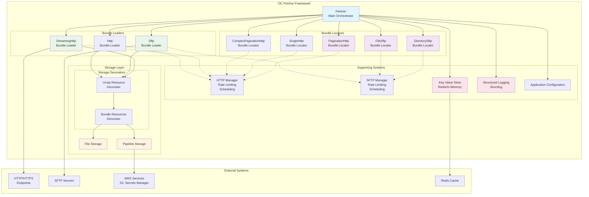
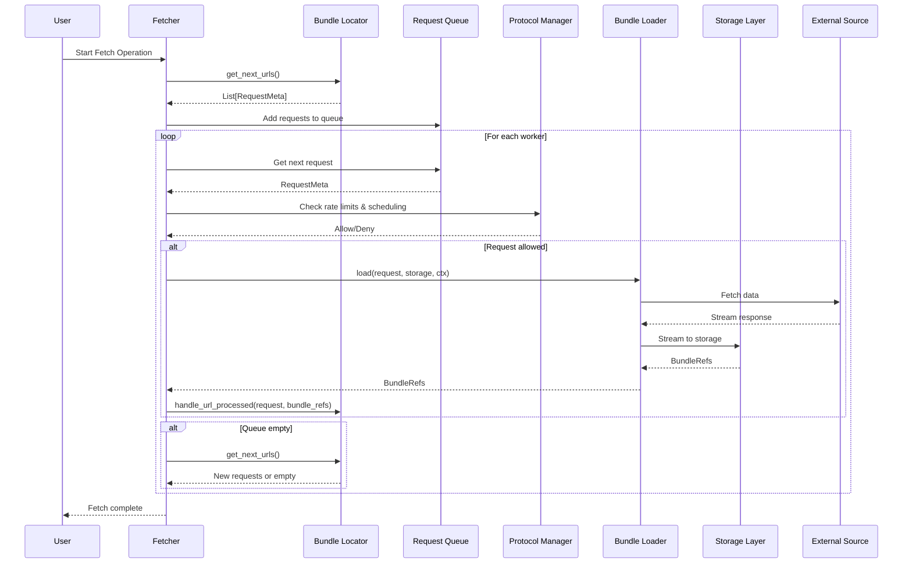
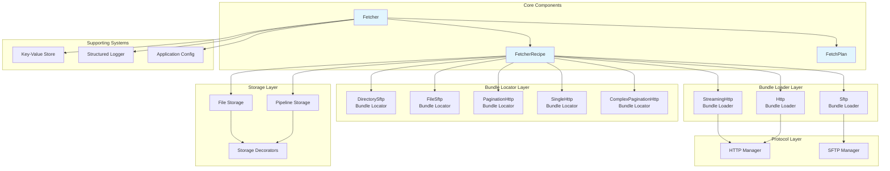

# Architecture Overview

The OC Fetcher framework is built around a composable, streaming-first architecture that coordinates three main components: **Bundle Locators**, **Bundle Loaders**, and **Storage**. The main `Fetcher` class orchestrates these components in a two-phase pipeline, with **Protocol Managers** handling cross-cutting concerns like rate limiting and scheduling.

## Core Architecture Principles

### 1. **Composable Design**
- Components can be mixed and matched to create different fetching configurations
- Storage decorators can be stacked for different processing needs
- Protocol managers provide reusable infrastructure services

### 2. **Streaming-First**
- Data flows through the system without loading entire files into memory
- Bundle loaders stream large payloads directly to storage

### 3. **Protocol Independence**
- Managers handle protocol-specific concerns (rate limiting, scheduling)
- Loaders focus on data fetching and streaming
- Locators generate URLs regardless of the underlying protocol

### 4. **Extensibility**
- New locators, bundle loaders, and storage backends can be easily added
- Supporting systems provide cross-cutting concerns
- Configuration system allows easy setup of common patterns

## Architecture Components

```mermaid
graph TB
    subgraph "Core Orchestration Layer"
        Fetcher[Fetcher<br/>Main Orchestrator]
        Recipe[FetcherRecipe<br/>Configuration & State]
        Plan[FetchPlan<br/>Execution Plan]
    end

    subgraph "Frontier Layer - URL Generation"
        Locator1[DirectorySftp<br/>Bundle Locator]
        Locator2[FileSftp<br/>Bundle Locator]
        Locator3[PaginationHttp<br/>Bundle Locator]
        Locator4[SingleHttp<br/>Bundle Locator]
        Locator5[ComplexPaginationHttp<br/>Bundle Locator]
    end

    subgraph "Loader Layer - Data Fetching"
        Loader1[StreamingHttp<br/>Bundle Loader]
        Loader2[Sftp<br/>Bundle Loader]
        Loader3[Http<br/>Bundle Loader]
    end

    subgraph "Storage Layer - Data Persistence"
        Decorator1[Unzip Resource<br/>Decorator]
        Decorator2[Bundle Resources<br/>Decorator]
        Storage1[File Storage<br/>Local Disk]
        Storage2[Pipeline Storage<br/>AWS S3]
    end

    subgraph "Supporting Systems"
        Manager1[HTTP Manager<br/>Rate Limiting & Scheduling]
        Manager2[SFTP Manager<br/>Rate Limiting & Scheduling]
        KVStore[Key-Value Store<br/>Redis/In-Memory]
        Logger[Structured Logging<br/>Context & JSON]
        Config[Application Configuration<br/>System Settings]
    end

    subgraph "External Systems"
        HTTP[HTTP/HTTPS<br/>Endpoints]
        SFTP[SFTP Servers]
        AWS[AWS Services<br/>S3, Secrets Manager]
        Redis[Redis Cache]
    end

    %% Core orchestration relationships
    Fetcher --> Recipe
    Fetcher --> Plan
    Recipe --> Locator1
    Recipe --> Locator2
    Recipe --> Locator3
    Recipe --> Locator4
    Recipe --> Locator5
    Recipe --> Loader1
    Recipe --> Loader2
    Recipe --> Loader3
    Recipe --> Storage1
    Recipe --> Storage2

    %% Loader to storage flow
    Loader1 --> Decorator1
    Loader2 --> Decorator1
    Loader3 --> Decorator1
    Decorator1 --> Decorator2
    Decorator2 --> Storage1
    Decorator2 --> Storage2

    %% Protocol manager relationships
    Locator1 -.-> Manager2
    Locator2 -.-> Manager2
    Locator3 -.-> Manager1
    Locator4 -.-> Manager1
    Locator5 -.-> Manager1
    Loader1 -.-> Manager1
    Loader2 -.-> Manager2
    Loader3 -.-> Manager1

    %% External system connections
    Loader1 --> HTTP
    Loader2 --> SFTP
    Loader3 --> HTTP
    Storage2 --> AWS
    KVStore --> Redis

    %% Supporting system connections
    Fetcher --> KVStore
    Fetcher --> Logger
    Fetcher --> Config

    %% Styling
    style Fetcher fill:#e1f5fe,stroke:#1976d2,stroke-width:3px
    style Recipe fill:#e1f5fe,stroke:#1976d2,stroke-width:2px
    style Plan fill:#e1f5fe,stroke:#1976d2,stroke-width:2px
    style Locator1 fill:#f3e5f5,stroke:#7b1fa2,stroke-width:2px
    style Locator2 fill:#f3e5f5,stroke:#7b1fa2,stroke-width:2px
    style Locator3 fill:#f3e5f5,stroke:#7b1fa2,stroke-width:2px
    style Locator4 fill:#f3e5f5,stroke:#7b1fa2,stroke-width:2px
    style Locator5 fill:#f3e5f5,stroke:#7b1fa2,stroke-width:2px
    style Loader1 fill:#e8f5e8,stroke:#388e3c,stroke-width:2px
    style Loader2 fill:#e8f5e8,stroke:#388e3c,stroke-width:2px
    style Loader3 fill:#e8f5e8,stroke:#388e3c,stroke-width:2px
    style Storage1 fill:#fff3e0,stroke:#f57c00,stroke-width:2px
    style Storage2 fill:#fff3e0,stroke:#f57c00,stroke-width:2px
    style KVStore fill:#fce4ec,stroke:#c2185b,stroke-width:2px
    style Logger fill:#fce4ec,stroke:#c2185b,stroke-width:2px
    style Config fill:#fce4ec,stroke:#c2185b,stroke-width:2px
```



### **Core Orchestration**
- **Fetcher**: Main orchestrator that coordinates all components
- **FetcherRecipe**: Configuration and state management
- **FetchPlan**: Execution plan with concurrency settings

### **Frontier Layer**
- **Bundle Locators**: Generate URLs for processing
  - DirectorySftpBundleLocator for SFTP directory scanning
  - FileSftpBundleLocator for specific SFTP files
  - create_pagination_http_bundle_locator for API pagination
  - create_single_http_bundle_locator for single API endpoints
  - create_complex_pagination_http_bundle_locator for complex API pagination

### **Loader Layer**
- **Bundle Loaders**: Fetch data from endpoints
  - StreamingHttpBundleLoader for HTTP/HTTPS streaming
  - SftpBundleLoader for SFTP file downloads
  - HttpBundleLoader for API endpoints

### **Storage Layer**
- **Base Storage**: File Storage and Pipeline Storage
- **Storage Decorators**: Unzip, Bundle Resources

### **Supporting Systems**
- **Protocol Managers**: Rate limiting and scheduling
- **Key-Value Store**: Caching and state management
- **Structured Logging**: Context variables and JSON output
- **Application Configuration**: System-wide settings

## High-Level Architecture Diagram



## Data Flow Sequence



## Component Relationships



## Module Hierarchy

The Data Fetcher framework is organized into focused, modular packages that follow a clear hierarchical structure:

```
data_fetcher_app (Application Layer)
├── data_fetcher_core (Core Framework)
├── data_fetcher_recipes (Recipe Layer)
│   ├── data_fetcher_sftp (SFTP Protocol)
│   └── data_fetcher_http_api (HTTP API Protocol)
├── data_fetcher_http (HTTP Protocol)
└── data_fetcher_sftp (SFTP Protocol)
```

### **Application Layer**
- **`data_fetcher_app`**: Main application entry point and configuration files
  - CLI interface and application entry point
  - Configuration loading and management
  - Dependencies: All other modules

### **Core Framework**
- **`data_fetcher_core`**: Core framework components and common utilities
  - Fetcher orchestration
  - Registry system for component management
  - Global providers (credentials, storage, KV store)
  - Utilities and structured logging
  - Core abstractions and interfaces
  - Dependencies: None (foundation layer)

### **Recipe Layer**
- **`data_fetcher_recipes`**: Predefined recipes for different data sources
  - Country-specific recipes (us-fl, fr)
  - Recipe templates and presets
  - Dependencies: Core framework and protocol implementations

### **Protocol Implementations**
- **`data_fetcher_sftp`**: SFTP-specific classes and modules
  - SFTP authentication and connection management
  - SFTP bundle locators for file discovery
  - SFTP loader for streaming file downloads
  - SFTP manager for protocol-level policies
  - Dependencies: Core framework

- **`data_fetcher_http`**: HTTP-specific classes and modules
  - HTTP loader for basic HTTP requests
  - HTTP manager for protocol-level policies
  - Basic HTTP support and utilities
  - Dependencies: Core framework

- **`data_fetcher_http_api`**: HTTP API-specific classes and modules
  - API bundle locators for API endpoint discovery
  - Pagination support for large datasets
  - Generic API patterns and abstractions
  - API-specific loaders and managers
  - Dependencies: Core framework

## Key Architectural Features

- **Concurrent Processing**: Multiple workers process requests simultaneously
- **Queue-Based URL Generation**: New URLs are generated only when the queue is empty
- **Thread-Safe Coordination**: Proper locking prevents race conditions
- **Completion Coordination**: Workers coordinate shutdown when no more URLs are available
- **URL Processing Callbacks**: Bundle locators are notified when URLs are successfully processed
- **Protocol-Level Rate Limiting**: Rate limiting is handled at the protocol level for better performance
- **Scheduling Support**: Built-in support for daily and interval-based scheduling

## Next Steps

- **[Orchestration](../orchestration/README.md)** - Learn how the fetcher coordinates components
- **[Recipes](../recipes/README.md)** - Understand the recipe system
- **[Locators](../locators/README.md)** - Explore URL generation
- **[Loaders](../loaders/README.md)** - Learn about data fetching
- **[Storage](../storage/README.md)** - Understand data persistence
- **[State Management](../state_management/README.md)** - Learn about state management
