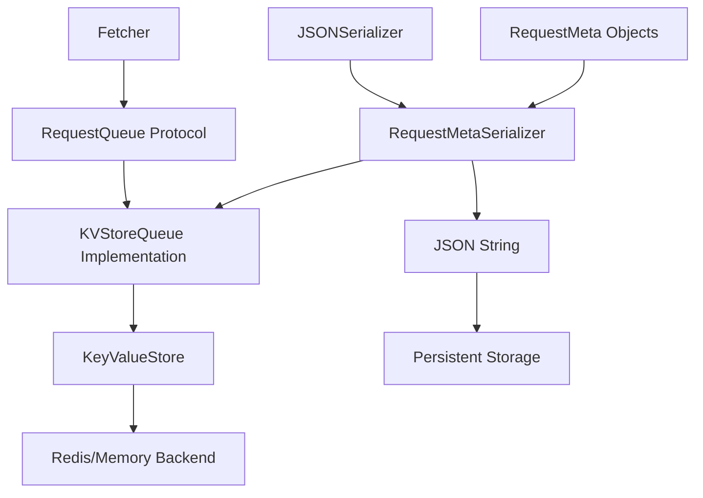

# Persistent Queue System

The persistent queue system provides durable, resumable request queuing for the data fetcher, enabling operations to survive application restarts without re-querying remote data providers.

## Overview

The persistent queue system replaces the in-memory `asyncio.Queue` with a durable, thread-safe queue backed by the existing key-value store infrastructure. This enables:

- **Resumable Operations**: Queue state persists across application restarts
- **No Re-querying**: Items remain in queue until processed
- **Thread Safety**: Concurrent access with async locks
- **Namespace Isolation**: Different runs use separate queue namespaces
- **Existing Infrastructure**: Leverages current kv_store implementations (Redis, memory)

## Architecture

### Queue Components



### Core Components

#### **RequestQueue Protocol**
Defines the interface for persistent queue implementations:

```python
class RequestQueue(Protocol):
    async def enqueue(self, items: Iterable[object]) -> int: ...
    async def dequeue(self, max_items: int = 1) -> list[object]: ...
    async def size(self) -> int: ...
    async def peek(self, max_items: int = 1) -> list[object]: ...
    async def clear(self) -> int: ...
    async def close(self) -> None: ...
```

#### **KVStoreQueue Implementation**
Concrete implementation using the existing KeyValueStore:

- **Namespace Isolation**: Each run uses `fetch:{run_id}` namespace
- **Counter-based Storage**: Uses sequential IDs for queue items
- **Thread Safety**: Async locks for concurrent operations
- **Simple Design**: No complex lease system - items persist until dequeued

#### **Serialization**
Specialized serializers for queue items:

- **JSONSerializer**: General-purpose JSON serialization
- **RequestMetaSerializer**: Specialized for RequestMeta objects with proper reconstruction

## Implementation Details

### Queue Storage Structure

The KVStoreQueue uses a simple counter-based approach:

```
{namespace}:items:{id}     -> serialized RequestMeta
{namespace}:next_id        -> next available ID
{namespace}:size           -> current queue size
```

### Namespace Isolation

Each fetcher run uses a unique namespace based on the run ID:

```python
namespace = f"fetch:{run_ctx.run_id}"
```

This ensures:
- Different runs don't interfere with each other
- Queue state is isolated per execution
- Easy cleanup and management

### Thread Safety

The implementation provides thread safety through:

- **Async Locks**: Critical sections protected with `asyncio.Lock`
- **Atomic Operations**: Grouped operations within locks
- **Concurrent Access**: Multiple workers can safely access the queue

## Integration with Fetcher

### Queue Creation

The fetcher automatically creates a persistent queue when running:

```python
# In Fetcher.run()
queue: RequestQueue = KVStoreQueue(
    kv_store=run_ctx.app_config.kv_store,
    namespace=f"fetch:{run_ctx.run_id}",
    serializer=RequestMetaSerializer()
)
```

### Queue Usage

The fetcher uses the queue for:

1. **Locator Thread**: Enqueues discovered URLs
2. **Worker Threads**: Dequeues requests for processing
3. **Backpressure**: Maintains target queue size
4. **Cleanup**: Properly closes queue resources

### Requirements

The fetcher now requires a kv_store in the app configuration:

```python
if not run_ctx.app_config or not run_ctx.app_config.kv_store:
    raise ValueError("kv_store is required for persistent queue")
```

## Configuration

### App Configuration

The queue automatically uses the kv_store from the app configuration:

```python
app_config = await create_fetcher_config(
    kv_store_type="redis",  # or "memory" for testing
    storage_type="s3",
    # ... other config
)
```

### Queue Settings

- **Namespace**: Automatically set to `fetch:{run_id}`
- **Serializer**: Uses `RequestMetaSerializer` by default
- **Backend**: Inherits from kv_store configuration (Redis, memory, etc.)

## Benefits

### Resumability
- Queue state persists across application restarts
- No need to re-query remote data providers
- Seamless continuation of interrupted operations

### Performance
- Leverages existing kv_store infrastructure
- Efficient serialization with JSON
- Minimal overhead compared to in-memory queue

### Reliability
- Thread-safe concurrent access
- Proper error handling and cleanup
- Namespace isolation prevents conflicts

### Simplicity
- No complex lease management
- Items persist until explicitly dequeued
- Clean integration with existing fetcher logic

## Usage Examples

### Basic Queue Operations

```python
from data_fetcher_core.queue import KVStoreQueue, RequestMetaSerializer
from data_fetcher_core.kv_store import create_kv_store
from data_fetcher_core.core import RequestMeta
from yarl import URL

# Create queue
kv_store = create_kv_store(store_type="memory")
queue = KVStoreQueue(
    kv_store=kv_store,
    namespace="test_queue",
    serializer=RequestMetaSerializer()
)

# Enqueue requests
requests = [
    RequestMeta(url=URL("https://example.com/1")),
    RequestMeta(url=URL("https://example.com/2")),
]
await queue.enqueue(requests)

# Check size
size = await queue.size()  # 2

# Dequeue items
dequeued = await queue.dequeue(max_items=1)
# dequeued[0] is a RequestMeta object

# Cleanup
await queue.close()
```

### Fetcher Integration

```python
from data_fetcher_core.fetcher import Fetcher
from data_fetcher_core.config_factory import create_fetcher_config

# Create app config with kv_store
app_config = await create_fetcher_config(
    kv_store_type="redis",
    storage_type="s3",
    # ... other config
)

# Create fetcher plan
plan = FetchPlan(
    recipe=recipe,
    context=FetchRunContext(run_id="my_run", app_config=app_config),
    concurrency=4,
    target_queue_size=100
)

# Run fetcher - automatically uses persistent queue
fetcher = Fetcher()
result = await fetcher.run(plan)
```

## Testing

The queue system includes comprehensive tests:

- **Unit Tests**: Queue operations, serialization, thread safety
- **Integration Tests**: Fetcher integration, persistence, namespace isolation
- **Error Handling**: Invalid inputs, edge cases, cleanup

Run tests with:

```bash
# Queue unit tests
poetry run python -m pytest tests/test_unit/data_fetcher_core/test_queue.py -v

# Integration tests
poetry run python -m pytest tests/test_integration/data_fetcher_core/test_queue_integration.py -v
```

## Migration Notes

### Breaking Changes
- **kv_store Required**: Fetcher now requires kv_store in app_config
- **Queue Type**: Changed from `asyncio.Queue` to `RequestQueue` protocol

### Backward Compatibility
- **API Compatibility**: Fetcher API remains the same
- **Configuration**: Existing app_config patterns still work
- **Behavior**: Queue operations are transparent to users

### Migration Steps
1. Ensure app_config includes kv_store
2. Update any direct queue usage (if any)
3. Test with existing configurations

## Future Enhancements

Potential improvements for the queue system:

- **Priority Queues**: Support for request prioritization
- **Dead Letter Queues**: Handle failed requests
- **Metrics**: Queue size, processing rate, etc.
- **Compression**: Reduce storage overhead for large queues
- **Batch Operations**: Optimize bulk enqueue/dequeue operations
