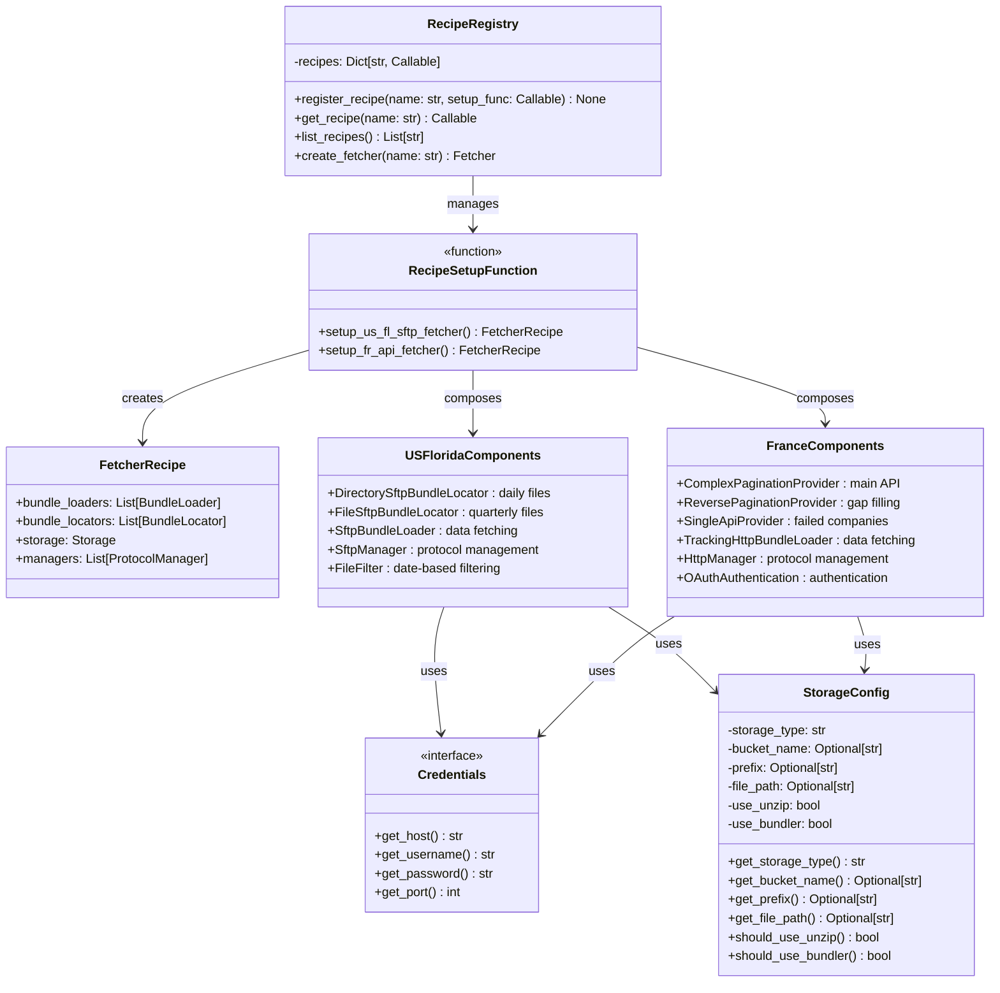

# Recipes

Recipes are the configuration system that defines how the OC Fetcher framework behaves for specific jurisdictions and data providers. They provide a declarative way to configure all components of the fetcher, including locators, loaders, storage, and supporting systems.

## What are Recipes?

Recipes are predefined configurations that specify:
- Which bundle locators to use for URL generation
- Which bundle loaders to use for data fetching
- How to configure storage and decorators
- Protocol-specific settings via ProtocolConfig objects (rate limiting, authentication)
- Jurisdiction-specific parameters (file patterns, date ranges)

## Recipe Architecture: Composable Design

Recipes follow a **composable architecture** rather than using inheritance. Each recipe is implemented as a function that returns a `FetcherRecipe` object, allowing for flexible composition of components without rigid class hierarchies.

### Key Principles:
- **Composition over Inheritance**: Recipes compose existing components rather than extending base classes
- **Functional Approach**: Each recipe is a setup function that configures and returns a complete fetcher recipe
- **Modular Components**: Individual components (locators, loaders, managers) can be mixed and matched
- **Protocol Independence**: Recipes can combine different protocols (SFTP, HTTP, API) as needed

### Benefits of Composable Architecture:
- **Flexibility**: Easy to create new recipes by combining existing components in different ways
- **Reusability**: Components can be shared across multiple recipes without code duplication
- **Testability**: Individual components can be tested in isolation
- **Maintainability**: Changes to components automatically benefit all recipes that use them
- **Extensibility**: New components can be added without modifying existing recipes

## Recipe Structure

Recipes are organized in the `data_fetcher_recipes` package and follow a consistent structure:

```
data_fetcher_recipes/
├── __init__.py
├── us_fl.py                   # US Florida recipe function
└── fr.py                      # France recipe function
```

Each recipe file contains:
- A setup function that creates and configures all necessary components
- Component-specific logic (filters, query builders, error handlers)
- Registration of the recipe with the framework

## Recipe Architecture Diagram



## Recipe Components

### **Bundle Locators**
Recipes define which locators to use for URL generation. Locators now accept ProtocolConfig objects:

```python
def get_locators(self) -> List[BundleLocator]:
    # Create protocol configuration
    sftp_config = create_sftp_protocol_config(
        config_name="us_fl_sftp",
        connect_timeout=20.0,
        rate_limit_requests_per_second=2.0
    )

    return [
        create_directory_provider(
            sftp_config=sftp_config,
            remote_dir="/doc/cor/",
            filename_pattern="*.txt",
            file_filter=DateFilter(start_date="2023-07-28"),
            sort_key=SortBy.MODIFICATION_TIME,
            sort_reverse=True,
            state_management_prefix="us_fl_daily_provider"
        ),
        create_directory_provider(
            sftp_config=sftp_config,
            remote_dir="/doc/Quarterly/Cor/",
            filename_pattern="cordata.zip",
            state_management_prefix="us_fl_quarterly_provider"
        )
    ]
```

### **Bundle Loaders**
Recipes specify which loaders to use for data fetching. Loaders now accept ProtocolConfig objects:

```python
def get_loaders(self) -> List[BundleLoader]:
    # Create protocol configuration
    sftp_config = create_sftp_protocol_config(
        config_name="us_fl_sftp",
        connect_timeout=20.0,
        rate_limit_requests_per_second=2.0
    )

    return [
        create_sftp_loader(
            sftp_config=sftp_config,
            meta_load_name="sftp_loader"
        )
    ]
```

### **Storage Configuration**
Recipes configure storage with appropriate decorators:

```python
def get_storage(self) -> Storage:
    base_storage = PipelineStorage(
        bucket_name=self.storage_config.bucket,
        prefix=self.storage_config.prefix
    )

    # Apply decorators in order
    storage = UnzipResourceDecorator(base_storage)

    return storage
```

### **Protocol Managers**
Recipes no longer need to configure protocol managers directly. Managers are created via factory functions and handle multiple connection pools based on ProtocolConfig objects:

```python
# Managers are created via factory functions when needed
# ProtocolConfig objects define the connection settings
# Components use ProtocolConfig objects instead of manager instances
```

## Available Recipes

### **US Florida Recipe (`us-fl`)**

The US Florida recipe is an SFTP-based fetcher that processes business registration and licensing data from Florida state systems.

**Key Features:**
- **SFTP Protocol**: Secure file transfer with SSH authentication
- **Dual Data Sources**: Daily files and quarterly archives
- **Date-based Filtering**: Processes files from 2023-07-28 onwards
- **Automatic Processing**: Download, validate, and store files with bundling

**Data Sources:**
- **Daily Files**: Text files from `doc/cor/` directory with date-based filtering
- **Quarterly Files**: ZIP archives from `doc/Quarterly/Cor/cordata.zip`

**Technical Configuration:**
- **Connection Timeout**: 20 seconds
- **Rate Limiting**: 2 requests/second
- **File Patterns**: `*.txt` files for daily data
- **Date Filter**: Extracts 8-digit dates (YYYYMMDD) from filenames
- **Sorting**: By modification time (newest first)
- **State Management**: Uses key-value store for tracking processed files

### **France Recipe (`fr`)**

The France recipe is an API-based fetcher with pagination support for French data sources.

**Key Features:**
- **HTTP/HTTPS Protocol**: RESTful API communication
- **Pagination Support**: Handles large datasets with automatic pagination
- **OAuth Authentication**: Secure API access
- **Rate Limiting**: Respects API rate limits

## Recipe Usage

### **Command Line Usage**
```bash
# Run US Florida recipe
poetry run python -m data_fetcher_app.main run us-fl

# Run France recipe
poetry run python -m data_fetcher_app.main run fr

# List all available recipes
poetry run python -m data_fetcher_app.main list
```

### **Programmatic Usage**
```python
from data_fetcher_core.recipebook import get_fetcher

# Get a predefined recipe
fetcher = get_fetcher("us-fl")
result = await fetcher.run(plan)

# Get France recipe
fetcher = get_fetcher("fr")
result = await fetcher.run(plan)
```

## Recipe Configuration

### **Credential Management**
Recipes support multiple credential providers:

#### AWS Secrets Manager (Default)
```bash
# Use AWS Secrets Manager for credentials (default behavior)
poetry run python -m data_fetcher_app.main run us-fl

# Explicitly specify AWS provider
poetry run python -m data_fetcher_app.main run us-fl --credentials-provider aws
```

#### Environment Variables
```bash
# Use environment variables for credentials
poetry run python -m data_fetcher_app.main run us-fl --credentials-provider env
```

### **Storage Configuration**
Recipes automatically configure storage based on environment variables:

```bash
# S3 Storage
export OC_STORAGE_TYPE=s3
export OC_S3_BUCKET=my-data-bucket
export OC_S3_PREFIX=us-fl-data/
export AWS_REGION=eu-west-2

# File Storage
export OC_STORAGE_TYPE=file
export OC_STORAGE_FILE_PATH=/data/captures
```

## Creating New Recipes

### **1. Create Recipe Setup Function**
```python
from data_fetcher_core.core import FetcherRecipe, create_fetcher_config
from data_fetcher_core.recipebook import register_recipe

def _setup_my_custom_fetcher() -> FetcherRecipe:
    """My custom data source recipe setup function."""
    # Create and configure components
    # Implementation here
    pass
```

### **2. Implement Component Configuration**
```python
def _setup_my_custom_fetcher() -> FetcherRecipe:
    """My custom data source recipe setup function."""

    # Create protocol configuration
    http_config = create_http_protocol_config(
        timeout=30.0,
        rate_limit_requests_per_second=1.0,
        max_retries=3
    )

    # Create loaders
    loader = create_tracking_http_bundle_loader(
        http_config=http_config,
        meta_load_name="my_custom_loader"
    )

    # Create locators
    locator = create_single_http_bundle_locator(
        http_config=http_config,
        urls=["https://api.example.com/data"],
        headers={"Accept": "application/json"},
        state_management_prefix="my_custom_provider"
    )

    # Build and return configuration
    return (
        create_fetcher_config()
        .use_bundle_loader(loader)
        .add_bundle_locator(locator)
        .build()
    )
```

### **3. Register Recipe**
```python
# Register the recipe with the framework
register_recipe("my-custom", _setup_my_custom_fetcher)
```

## Recipe Best Practices

### **Configuration Management**
- Use environment variables for deployment-specific settings
- Provide sensible defaults for development
- Document all configuration options

### **Error Handling**
- Implement robust error handling for network issues
- Provide meaningful error messages
- Include retry logic where appropriate

### **Performance Optimization**
- Configure appropriate rate limits
- Use connection pooling where possible
- Optimize for the specific data source characteristics

### **Testing**
- Include comprehensive tests for recipe components
- Test with mock data sources
- Validate configuration options

## Next Steps

- **[Locators](../locators/README.md)** - Learn about URL generation components
- **[Loaders](../loaders/README.md)** - Understand data fetching components
- **[Storage](../storage/README.md)** - Learn about data persistence
- **[State Management](../state_management/README.md)** - Understand state management
