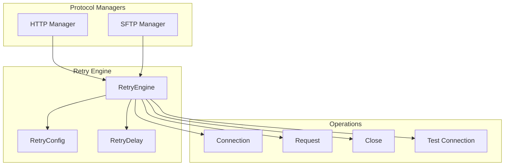
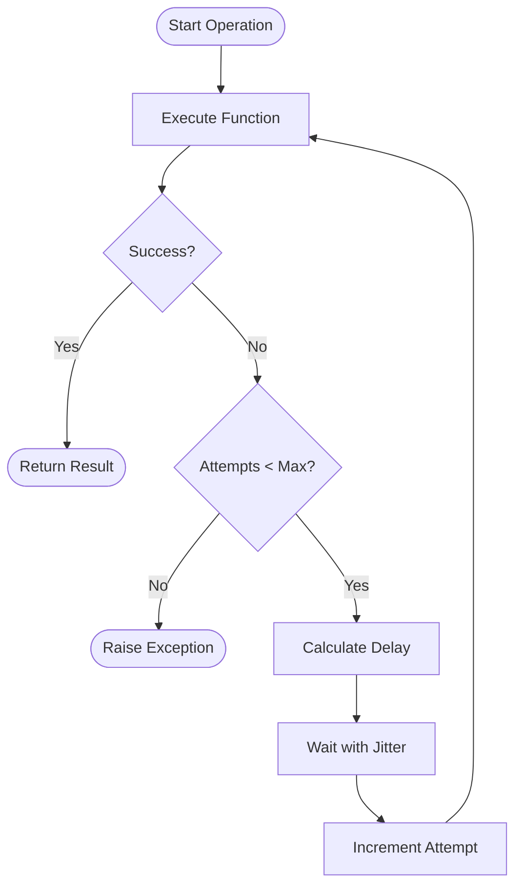

# Retry Engine

The Retry Engine provides robust, configurable retry logic for handling transient failures in network operations. It implements exponential backoff with jitter to ensure reliable data fetching across both HTTP and SFTP protocols.

## What is the Retry Engine?

The Retry Engine is a cross-cutting concern that:

- **Handles Transient Failures**: Automatically retries operations that fail due to temporary issues
- **Implements Exponential Backoff**: Uses increasing delays between retry attempts to avoid overwhelming services
- **Provides Jitter**: Adds randomness to retry delays to prevent thundering herd problems
- **Supports Multiple Protocols**: Works consistently across HTTP and SFTP operations
- **Configurable Behavior**: Allows customization of retry counts, delays, and backoff strategies

## Retry Engine Architecture

The retry system uses a layered approach with consistent behavior across protocol managers:



## Retry Engine Interface

The `RetryEngine` provides a unified interface for retry operations:

```python
class RetryEngine:
    def __init__(self, config: RetryConfig):
        """Initialize retry engine with configuration."""
        pass

    async def execute_with_retry_async(
        self,
        func: Callable[[], Awaitable[T]],
        *args,
        **kwargs
    ) -> T:
        """Execute function with retry logic."""
        pass

    def calculate_delay(self, attempt: int) -> float:
        """Calculate delay for retry attempt."""
        pass
```

## Retry Configuration

The `RetryConfig` class defines retry behavior:

```python
@dataclass
class RetryConfig:
    max_retries: int = 3
    base_delay: float = 1.0
    max_delay: float = 60.0
    exponential_base: float = 2.0
    jitter: bool = True
    jitter_range: Tuple[float, float] = (0.5, 1.5)
```

### Configuration Parameters

- **`max_retries`**: Maximum number of retry attempts (default: 3)
- **`base_delay`**: Initial delay in seconds (default: 1.0)
- **`max_delay`**: Maximum delay cap in seconds (default: 60.0)
- **`exponential_base`**: Base for exponential backoff (default: 2.0)
- **`jitter`**: Enable random jitter (default: True)
- **`jitter_range`**: Jitter range as (min, max) multipliers (default: (0.5, 1.5))

## Retry Flow

The retry process follows a consistent pattern:



## Delay Calculation

The retry engine uses exponential backoff with jitter:

```python
def calculate_delay(self, attempt: int) -> float:
    """Calculate delay with exponential backoff and jitter."""
    # Exponential backoff: base_delay * (exponential_base ^ attempt)
    delay = self.config.base_delay * (self.config.exponential_base ** attempt)

    # Cap at max_delay
    delay = min(delay, self.config.max_delay)

    # Add jitter if enabled
    if self.config.jitter:
        jitter_min, jitter_max = self.config.jitter_range
        jitter = random.uniform(jitter_min, jitter_max)
        delay *= jitter

    return delay
```

### Delay Examples

For default configuration (base_delay=1.0, exponential_base=2.0, jitter=True):

| Attempt | Base Delay | With Jitter Range |
| ------- | ---------- | ----------------- |
| 0       | 1.0s       | 0.5s - 1.5s       |
| 1       | 2.0s       | 1.0s - 3.0s       |
| 2       | 4.0s       | 2.0s - 6.0s       |
| 3       | 8.0s       | 4.0s - 12.0s      |

## Protocol Manager Integration

### HTTP Manager Integration

The HTTP manager uses the retry engine for all network operations:

```python
class HttpManager:
    def __init__(self, max_retries: int = 3, **kwargs):
        self.max_retries = max_retries
        self._retry_engine = create_retry_engine(max_retries=max_retries)

    async def request(self, method: str, url: str, **kwargs) -> httpx.Response:
        """Make HTTP request with retry logic."""
        async def _make_request() -> httpx.Response:
            # Actual HTTP request logic
            pass

        return await self._retry_engine.execute_with_retry_async(_make_request)
```

### SFTP Manager Integration

The SFTP manager uses the same retry engine pattern:

```python
class SftpManager:
    def __init__(self, max_retries: int = 3, **kwargs):
        self.max_retries = max_retries
        self._retry_engine = create_retry_engine(max_retries=max_retries)

    async def get_connection(self) -> Connection:
        """Get SFTP connection with retry logic."""
        async def _get_connection() -> Connection:
            # Actual connection logic
            pass

        return await self._retry_engine.execute_with_retry_async(_get_connection)
```

## Retry Engine Factory

The `create_retry_engine` function provides a convenient way to create configured retry engines:

```python
def create_retry_engine(
    max_retries: int = 3,
    base_delay: float = 1.0,
    max_delay: float = 60.0,
    exponential_base: float = 2.0,
    jitter: bool = True,
    jitter_range: Tuple[float, float] = (0.5, 1.5)
) -> RetryEngine:
    """Create a retry engine with specified configuration."""
    config = RetryConfig(
        max_retries=max_retries,
        base_delay=base_delay,
        max_delay=max_delay,
        exponential_base=exponential_base,
        jitter=jitter,
        jitter_range=jitter_range
    )
    return RetryEngine(config)
```

## Usage Examples

### Basic Retry Usage

```python
from data_fetcher_core.utils.retry import create_retry_engine

# Create retry engine
retry_engine = create_retry_engine(max_retries=3)

# Use with async function
async def fetch_data():
    # Your operation that might fail
    pass

result = await retry_engine.execute_with_retry_async(fetch_data)
```

### Custom Configuration

```python
# Custom retry configuration
retry_engine = create_retry_engine(
    max_retries=5,
    base_delay=0.5,
    max_delay=30.0,
    exponential_base=1.5,
    jitter=True,
    jitter_range=(0.8, 1.2)
)
```

### Protocol Manager Configuration

```python
# HTTP manager with custom retry settings
http_manager = HttpManager(
    max_retries=5,
    timeout=30.0,
    rate_limit_requests_per_second=10.0
)

# SFTP manager with custom retry settings
sftp_manager = SftpManager(
    max_retries=3,
    connect_timeout=20.0,
    rate_limit_requests_per_second=2.0
)
```

## Error Handling

The retry engine handles various types of transient errors:

### HTTP Errors
- **Connection Errors**: Network connectivity issues
- **Timeout Errors**: Request timeouts
- **Server Errors**: 5xx HTTP status codes
- **Rate Limiting**: 429 Too Many Requests

### SFTP Errors
- **Connection Failures**: SSH connection issues
- **Authentication Errors**: Credential problems
- **File Access Errors**: Permission or file not found
- **Network Timeouts**: SFTP operation timeouts

### Error Classification

```python
def is_retryable_error(error: Exception) -> bool:
    """Determine if an error should trigger a retry."""
    if isinstance(error, (ConnectionError, TimeoutError)):
        return True
    if isinstance(error, httpx.HTTPStatusError):
        return error.response.status_code >= 500
    return False
```

## Performance Considerations

### Retry Overhead
- **Minimal Impact**: Retry logic adds minimal overhead for successful operations
- **Exponential Backoff**: Prevents overwhelming services during outages
- **Jitter**: Reduces thundering herd effects

### Configuration Tuning
- **Max Retries**: Balance between reliability and performance
- **Base Delay**: Start with 1-2 seconds for most use cases
- **Max Delay**: Cap delays to prevent excessive wait times
- **Jitter**: Always enable to prevent synchronized retries

### Monitoring
```python
# Log retry attempts for monitoring
logger.info("RETRY_ATTEMPT", attempt=attempt, operation_name=operation_name)
logger.warning("OPERATION_FAILED_AFTER_MAX_RETRIES", max_retries=max_retries, error=str(error))
```

## Testing Retry Behavior

The retry engine includes comprehensive test coverage:

### Unit Tests
- **Retry Engine Creation**: Verify proper initialization
- **Delay Calculation**: Test exponential backoff and jitter
- **Success Scenarios**: Operations succeed after retries
- **Failure Scenarios**: Operations fail after exhausting retries
- **Configuration**: Different retry settings work correctly

### Integration Tests
- **Protocol Consistency**: Both HTTP and SFTP use same retry logic
- **Concurrent Operations**: Retry works with concurrent requests
- **Mixed Scenarios**: Some operations succeed, others fail
- **Performance**: Retry doesn't significantly impact performance

### Test Examples
```python
# Test retry success
async def test_retry_success():
    retry_engine = create_retry_engine(max_retries=3)

    call_count = 0
    async def failing_operation():
        nonlocal call_count
        call_count += 1
        if call_count < 3:
            raise ConnectionError("Temporary failure")
        return "success"

    result = await retry_engine.execute_with_retry_async(failing_operation)
    assert result == "success"
    assert call_count == 3
```

## Best Practices

### Configuration
- **Start Conservative**: Begin with 3 retries and 1-2 second base delay
- **Monitor Performance**: Track retry rates and adjust configuration
- **Use Jitter**: Always enable jitter to prevent synchronized retries
- **Cap Delays**: Set reasonable max_delay to prevent excessive waits

### Error Handling
- **Log Retries**: Log retry attempts for debugging and monitoring
- **Distinguish Errors**: Handle different error types appropriately
- **Graceful Degradation**: Provide fallback mechanisms when retries fail

### Performance
- **Minimize Retries**: Optimize operations to reduce failure rates
- **Monitor Metrics**: Track retry success rates and timing
- **Tune Configuration**: Adjust retry parameters based on service characteristics

## Troubleshooting

### Common Issues

**High Retry Rates**
- Check network connectivity
- Verify service availability
- Review rate limiting settings
- Consider increasing base_delay

**Long Wait Times**
- Reduce max_delay
- Decrease exponential_base
- Lower max_retries
- Check for service outages

**Inconsistent Behavior**
- Verify jitter is enabled
- Check configuration consistency
- Review error handling logic
- Test with different scenarios

### Debugging
```python
# Enable debug logging
import logging
logging.getLogger("data_fetcher_core.utils.retry").setLevel(logging.DEBUG)

# Monitor retry attempts
retry_engine = create_retry_engine(max_retries=3)
# ... use retry engine
```

## Additional Resources

- **[State Management](../state_management/README.md)** - Learn how retry integrates with state management
- **[Loaders](../loaders/README.md)** - See how loaders use the retry engine
- **[Orchestration](../orchestration/README.md)** - Understand retry's role in the overall system
- **[Testing Guide](../../testing/overview.md)** - Learn how to test retry behavior
