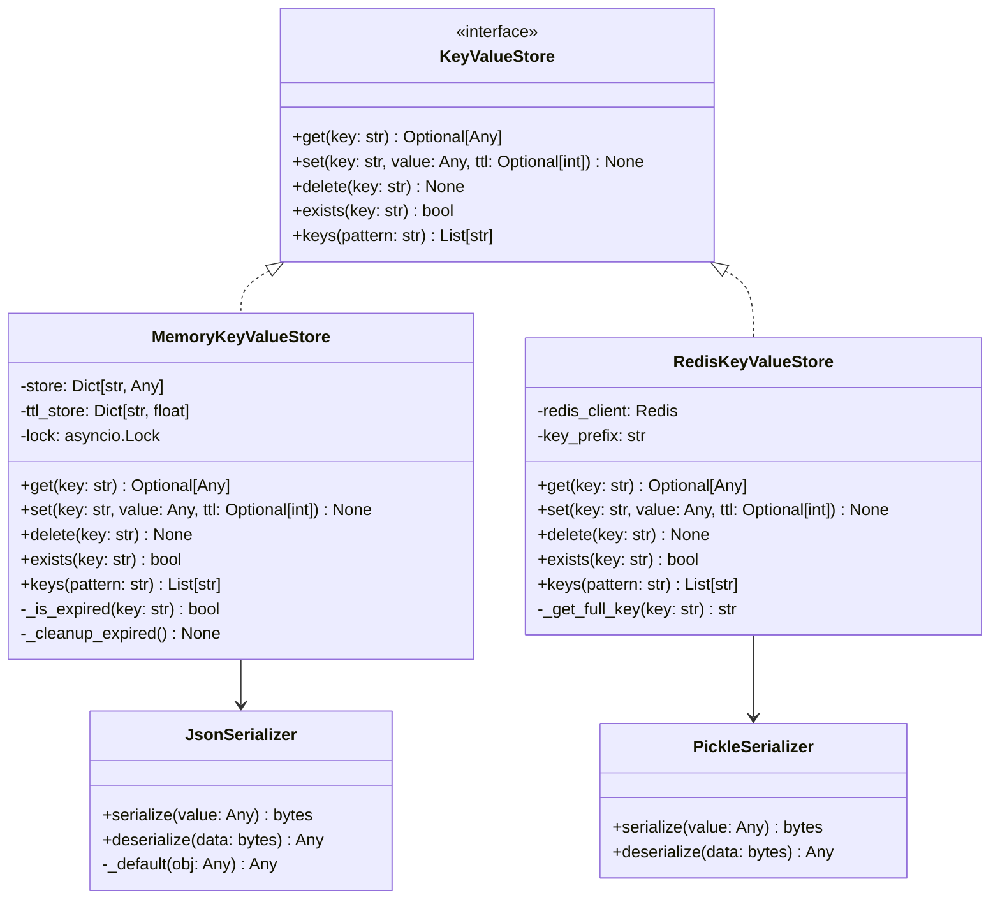

# State Management

The state management system manages state and caching through a key-value store abstraction. It provides a unified interface for storing and retrieving data across different backends (Redis, in-memory) and handles serialization, TTL management, and error handling.

The key-value store also powers the [Persistent Queue System](../queue/README.md), enabling durable request queuing for resumable operations.

## What is State Management?

The state management system:
- **Manages State**: Tracks processed URLs, configuration, and runtime state
- **Provides Caching**: Caches frequently accessed data for performance
- **Handles Serialization**: Converts data to/from storage formats (JSON, pickle)
- **Manages TTL**: Automatically expires data based on time-to-live settings
- **Provides Abstraction**: Offers a consistent interface regardless of the underlying store

## State Management Interface

The state management system implements the `KeyValueStore` protocol:

```python
class KeyValueStore(Protocol):
    async def get(self, key: str) -> Optional[Any]:
        """Get a value by key."""
        pass

    async def set(self, key: str, value: Any, ttl: Optional[int] = None) -> None:
        """Set a value with optional TTL."""
        pass

    async def delete(self, key: str) -> None:
        """Delete a value by key."""
        pass

    async def exists(self, key: str) -> bool:
        """Check if a key exists."""
        pass

    async def keys(self, pattern: str = "*") -> List[str]:
        """Get keys matching a pattern."""
        pass
```

## Persistence Architecture

The state management system uses a layered architecture:

```
Application → KeyValueStore → Serializer → Backend Store
```

### **Key-Value Store**
Provides the main interface for data operations

### **Serializers**
Handle data conversion between Python objects and storage formats:
- **JSON Serializer**: Human-readable format, limited data types
- **Pickle Serializer**: Binary format, supports all Python objects

### **Backend Stores**
Handle actual data state management:
- **Memory Store**: In-memory storage for development/testing
- **Redis Store**: Redis-based storage for production

## Persistence Class Hierarchy



## Backend Stores

### **MemoryKeyValueStore**
In-memory storage for development and testing.

**Features:**
- Fast access for development
- TTL support with automatic cleanup
- Thread-safe operations
- No external dependencies

**Example Configuration:**
```python
store = MemoryKeyValueStore(
    serializer=JsonSerializer(),
    default_ttl=3600
)
```

**Usage:**
```python
# Store data
await store.set("user:123", {"name": "John", "email": "john@example.com"}, ttl=3600)

# Retrieve data
user_data = await store.get("user:123")

# Check existence
exists = await store.exists("user:123")

# Delete data
await store.delete("user:123")
```

### **RedisKeyValueStore**
Redis-based storage for production environments.

**Features:**
- Distributed storage
- High performance
- Built-in TTL support
- Persistence to disk
- Clustering support

**Example Configuration:**
```python
store = RedisKeyValueStore(
    host="localhost",
    port=6379,
    db=0,
    password="secret",
    key_prefix="data_fetcher:",
    serializer=PickleSerializer(),
    default_ttl=3600
)
```

**Usage:**
```python
# Store data
await store.set("processed:url_123", {"status": "completed", "timestamp": "2024-01-01"})

# Retrieve data
status = await store.get("processed:url_123")

# Pattern matching
processed_urls = await store.keys("processed:*")
```

## Serializers

### **JsonSerializer**
Human-readable JSON format with limited data type support.

**Features:**
- Human-readable format
- Cross-language compatibility
- Limited data types (dict, list, str, int, float, bool, None)
- Automatic type conversion

**Example:**
```python
serializer = JsonSerializer()

# Serialize
data = {"name": "John", "age": 30, "active": True}
serialized = serializer.serialize(data)  # b'{"name": "John", "age": 30, "active": true}'

# Deserialize
deserialized = serializer.deserialize(serialized)  # {"name": "John", "age": 30, "active": True}
```

### **PickleSerializer**
Binary format supporting all Python objects.

**Features:**
- Supports all Python objects
- Compact binary format
- Fast serialization/deserialization
- Python-specific format

**Example:**
```python
serializer = PickleSerializer()

# Serialize complex objects
data = {"name": "John", "age": 30, "active": True, "created": datetime.now()}
serialized = serializer.serialize(data)

# Deserialize
deserialized = serializer.deserialize(serialized)
```

## Persistence Configuration

### **Environment Variables**
The state management system can be configured through environment variables:

```bash
# Store type
export OC_KV_STORE_TYPE=redis  # or "memory"

# Redis configuration
export OC_KV_STORE_REDIS_HOST=localhost
export OC_KV_STORE_REDIS_PORT=6379
export OC_KV_STORE_REDIS_DB=0
export OC_KV_STORE_REDIS_PASSWORD=secret
export OC_KV_STORE_REDIS_KEY_PREFIX=data_fetcher:

# Serializer configuration
export OC_KV_STORE_SERIALIZER=json  # or "pickle"

# TTL configuration
export OC_KV_STORE_DEFAULT_TTL=3600
```

### **Programmatic Configuration**
```python
# Configure application key-value store using config_factory
from data_fetcher_core.config_factory import create_fetcher_config

app_config = await create_fetcher_config(
    kv_store_type="memory",
    serializer="json",
    default_ttl=3600
)
```

## Persistence Examples

### **URL Tracking**
```python
# Track processed URLs
await store.set(f"processed:{url_hash}", {
    "url": url,
    "processed_at": datetime.now().isoformat(),
    "bundle_refs": bundle_refs
}, ttl=86400)  # 24 hours

# Check if URL was processed
if await store.exists(f"processed:{url_hash}"):
    print("URL already processed")
```

### **Configuration Caching**
```python
# Cache configuration
config_key = f"config:{recipe_name}"
if not await store.exists(config_key):
    config = load_recipe_config(recipe_name)
    await store.set(config_key, config, ttl=3600)  # 1 hour
else:
    config = await store.get(config_key)
```

### **Rate Limiting State**
```python
# Track rate limiting state
rate_limit_key = f"rate_limit:{endpoint}"
current_requests = await store.get(rate_limit_key) or 0

if current_requests >= max_requests:
    raise RateLimitExceeded("Too many requests")

await store.set(rate_limit_key, current_requests + 1, ttl=60)  # 1 minute
```

## TTL Management

### **Automatic Expiration**
```python
# Set TTL in seconds
await store.set("temp_data", data, ttl=3600)  # Expires in 1 hour

# Use default TTL
store = MemoryKeyValueStore(default_ttl=1800)  # 30 minutes default
await store.set("data", value)  # Uses default TTL
```

### **TTL Checking**
```python
# Check if data exists and is not expired
if await store.exists("key"):
    data = await store.get("key")
    if data is not None:
        # Data exists and is not expired
        process_data(data)
```

## Error Handling

### **Connection Errors**
```python
try:
    await store.set("key", value)
except ConnectionError:
    # Handle Redis connection errors
    logger.warning("REDIS_CONNECTION_FAILED_USING_FALLBACK")
    fallback_store.set("key", value)
```

### **Serialization Errors**
```python
try:
    await store.set("key", complex_object)
except SerializationError as e:
    logger.exception("DATA_SERIALIZATION_FAILED", error=str(e))
    # Handle serialization errors
```

## Performance Considerations

### **Connection Pooling**
```python
# Redis connection pooling
store = RedisKeyValueStore(
    host="localhost",
    port=6379,
    max_connections=20,
    retry_on_timeout=True
)
```

### **Batch Operations**
```python
# Batch operations for better performance
async with store.pipeline() as pipe:
    pipe.set("key1", "value1")
    pipe.set("key2", "value2")
    pipe.set("key3", "value3")
    await pipe.execute()
```

### **Memory Management**
```python
# Memory store with size limits
store = MemoryKeyValueStore(
    max_size=10000,  # Maximum number of keys
    cleanup_interval=300  # Cleanup every 5 minutes
)
```

## Creating Custom Stores

### **1. Implement KeyValueStore Protocol**
```python
from data_fetcher_core.kv_store import KeyValueStore

class MyCustomStore:
    async def get(self, key: str) -> Optional[Any]:
        # Implement get logic
        pass

    async def set(self, key: str, value: Any, ttl: Optional[int] = None) -> None:
        # Implement set logic
        pass

    async def delete(self, key: str) -> None:
        # Implement delete logic
        pass

    async def exists(self, key: str) -> bool:
        # Implement exists logic
        pass

    async def keys(self, pattern: str = "*") -> List[str]:
        # Implement keys logic
        pass
```

### **2. Add Serialization Support**
```python
class MyCustomStore:
    def __init__(self, serializer: Serializer):
        self.serializer = serializer

    async def set(self, key: str, value: Any, ttl: Optional[int] = None) -> None:
        serialized_value = self.serializer.serialize(value)
        # Store serialized value
```

### **3. Add Configuration**
```python
class MyCustomStore:
    def __init__(self, config: Dict[str, Any]):
        self.config = config

    async def get(self, key: str) -> Optional[Any]:
        # Use configuration
        pass
```

## Best Practices

### **Key Naming**
- Use consistent naming conventions
- Include prefixes for different data types
- Use descriptive names

### **TTL Management**
- Set appropriate TTL values
- Use different TTLs for different data types
- Monitor expiration patterns

### **Error Handling**
- Handle connection failures gracefully
- Implement fallback mechanisms
- Log errors appropriately

### **Performance**
- Use connection pooling
- Implement batch operations
- Monitor memory usage

### **Testing**
- Test with various data types
- Validate TTL behavior
- Test error conditions
- Verify serialization/deserialization

## Next Steps

- **[Orchestration](../orchestration/README.md)** - Understand how state management fits into the overall system
- **[Recipes](../recipes/README.md)** - Learn how state management is configured
- **[Locators](../locators/README.md)** - See how state management is used for URL tracking
- **[Loaders](../loaders/README.md)** - Understand how state management supports rate limiting
