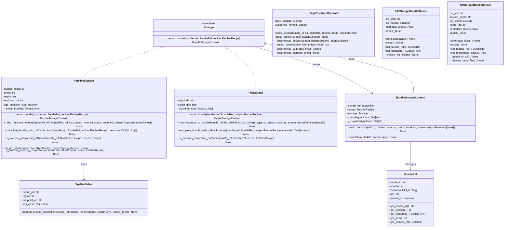

# Storage

The storage system is responsible for persisting fetched data with streaming support and metadata management. It uses a composable architecture with base storage implementations and decorators that can be stacked to provide different processing needs.

## What is Storage?

The storage system:
- **Persists Data**: Stores fetched data to various backends (file system, S3, etc.)
- **Streams Content**: Handles large files without loading them into memory
- **Manages Metadata**: Preserves and organizes metadata about stored data
- **Transforms Data**: Applies decorators for data transformation (unzipping, bundling)
- **Provides Abstraction**: Offers a consistent interface regardless of the underlying storage backend
- **Uses BIDs for Organization**: Leverages Bundle IDs (BIDs) for time-based file organization and tracing

## Storage Interface

All storage implementations implement the `Storage` protocol:

```python
class Storage(Protocol):
    async def start_bundle(
        self,
        bundle_ref: BundleRef,
        recipe: FetcherRecipe
    ) -> BundleStorageContext:
        """Initialize a new bundle and return a BundleStorageContext for managing it."""
        pass
```

The new interface uses `BundleStorageContext` for managing bundle lifecycle:

```python
class BundleStorageContext:
    async def add_resource(
        self,
        url: str,
        content_type: str | None,
        status_code: int,
        stream: AsyncGenerator[bytes],
    ) -> None:
        """Add a resource to the bundle."""
        pass

    async def complete(self, metadata: dict[str, Any]) -> None:
        """Complete the bundle after all uploads are finished."""
        pass
```

## Storage Architecture

The storage system uses a composable design with decorators:

```
Data Source → Unzip Decorator → Bundle Decorator → Base Storage
```

### **Storage Decorators**
Storage decorators modify streams being passed to storage implementations:

- **UnzipResourceDecorator**: Automatically decompresses gzip and zip resources

### **Base Storage**
Base storage implementations handle the actual state management:

- **FileStorage**: Stores files on local disk
- **PipelineStorage**: Stores files in S3 with metadata

## Storage Class Hierarchy



## BID Integration

The storage system leverages Bundle IDs (BIDs) for enhanced organization and tracing:

### **BID-based File Organization**

Storage implementations use BIDs to create time-ordered, unique directory structures:

#### File Storage
```python
# Directory naming using BID
bundle_dir = f"bundle_{bundle_ref.bid}"
# Example: bundle_17571960-2065-e0cd-cf71-8196d8577b7e
```

#### S3 Storage
```python
# S3 key organization using BID
s3_key = f"{prefix}/bundles/{bundle_ref.bid}/resources"
# Example: data/bundles/17571960-2065-e0cd-cf71-8196d8577b7e/resources
```

### **BID in Metadata**

All storage implementations include BID information in metadata:

```python
metadata = {
    "bid": str(bundle_ref.bid),
    "primary_url": bundle_ref.primary_url,
    "resources_count": bundle_ref.resources_count,
    "storage_key": bundle_key,
    "meta": bundle_ref.meta,
}
```

### **Benefits of BID Integration**

- **Time-based Organization**: BIDs contain timestamp information for chronological sorting
- **Unique Identification**: Each bundle has a guaranteed unique identifier
- **Enhanced Tracing**: BID context enables correlation across the entire pipeline
- **Future Extensibility**: Foundation for deduplication, retry logic, and analytics

For more details, see the [Bundle ID (BID) Architecture](../bid/README.md) documentation.

## SQS Notifications and Completion Callbacks

The storage system now supports SQS notifications and completion callbacks for enhanced integration and monitoring.

### **SQS Notifications**

When bundles are completed, the system can automatically send notifications to Amazon SQS:

```python
# SQS Publisher Configuration
sqs_publisher = SqsPublisher(
    queue_url="https://sqs.eu-west-2.amazonaws.com/123456789012/bundle-completions",
    region="eu-west-2"
)

# PipelineStorage with SQS notifications
storage = PipelineStorage(
    bucket_name="my-bucket",
    sqs_publisher=sqs_publisher
)
```

**SQS Message Format:**
```json
{
    "bundle_id": "17572488-4023-67e2-0f15-c21600a05797",
    "recipe_id": "fr",
    "primary_url": "https://api.insee.fr/entreprises/sirene/V3.11/siren",
    "resources_count": 1,
    "storage_key": "data/bundles/17572488-4023-67e2-0f15-c21600a05797/resources",
    "completion_timestamp": "2024-01-15T10:30:00Z",
    "metadata": {
        "source": "http_api",
        "run_id": "run_123",
        "resources_count": 1
    }
}
```

### **Completion Callbacks**

Storage components execute completion callbacks from recipe components:

```python
# Loader completion callback
class MyLoader:
    async def on_bundle_complete_hook(self, bundle_ref: BundleRef) -> None:
        """Called when a bundle is completed."""
        # Update tracking, send notifications, etc.
        pass

# Locator completion callback
class MyLocator:
    async def on_bundle_complete_hook(self, bundle_ref: BundleRef) -> None:
        """Called when a bundle is completed."""
        # Update state, mark URLs as processed, etc.
        pass
```

### **Pending Completion Processing**

The system handles eventual consistency through pending completion processing:

1. **Bundle Completion**: Storage marks bundle as pending_completion in KV store
2. **Callback Execution**: Success callbacks are executed
3. **SQS Notification**: Bundle completion is published to SQS
4. **Cleanup**: Pending completion key is removed from KV store
5. **Startup Recovery**: `on_run_start` hook processes any pending completions

```python
# Storage with on_run_start hook
class PipelineStorage:
    async def on_run_start(self, context: FetchRunContext, recipe: FetcherRecipe) -> None:
        """Process any pending SQS notifications from previous runs."""
        await self._process_pending_completions(context, recipe)
```

## Base Storage Implementations

### **FileStorage**
Stores files on local disk with custom output directory support. Resources are saved directly to subdirectories without zipping.

**Features:**
- Local file system storage
- Custom output directories
- Automatic directory creation
- File metadata preservation
- BID-based directory naming
- Direct resource storage (no zipping)
- No external dependencies

**Example Configuration:**
```python
storage = FileStorage("/data/captures")
```

**Usage:**
```python
# Create bundle reference
bundle_ref = BundleRef(primary_url="https://example.com", resources_count=2)

# Start bundle and get context
bundle_context = await storage.start_bundle(bundle_ref, recipe)

# Add resources
await bundle_context.add_resource("https://example.com/page.html", "text/html", 200, stream1)
await bundle_context.add_resource("https://example.com/data.json", "application/json", 200, stream2)

# Complete bundle
await bundle_context.complete({"source": "us-fl"})
# Resources are saved directly to /data/captures/bundle_123/ as individual files
```

### **PipelineStorage**
Stores files in S3 with metadata and environment-specific bucket naming. Resources are automatically bundled into zip files before upload. **Requires SQS notifications for bundle completion tracking.**

**Features:**
- AWS S3 integration
- Metadata storage
- Environment-specific bucket naming
- Streaming uploads
- Automatic retry logic
- Automatic resource bundling (zip files)
- **Mandatory SQS notifications for bundle completion**
- Pending completion processing for eventual consistency

**Example Configuration:**
```python
from data_fetcher_core.notifications import SqsPublisher

# SQS publisher is mandatory for PipelineStorage
sqs_publisher = SqsPublisher(
    queue_url="https://sqs.eu-west-2.amazonaws.com/123456789012/bundle-completions",
    region="eu-west-2"
)

storage = PipelineStorage(
    bucket_name="my-data-bucket",
    sqs_publisher=sqs_publisher,
    prefix="captures/2024/"
)
```

**Usage:**
```python
# Create bundle reference
bundle_ref = BundleRef(primary_url="https://example.com", resources_count=2)

# Start bundle and get context
bundle_context = await storage.start_bundle(bundle_ref, recipe)

# Add resources
await bundle_context.add_resource("https://example.com/page.html", "text/html", 200, stream1)
await bundle_context.add_resource("https://example.com/data.json", "application/json", 200, stream2)

# Complete bundle (triggers SQS notification and callbacks)
await bundle_context.complete({"source": "us-fl"})
# Resources are bundled into a zip file and uploaded to S3
```

## Storage Decorators

### **UnzipResourceDecorator**
Automatically decompresses gzip and zip resources before processing.

**Features:**
- Automatic compression detection
- Support for gzip and zip formats
- Preserves original file structure
- Streaming decompression

**Example Configuration:**
```python
base_storage = FileStorage("/data/captures")
storage = UnzipResourceDecorator(base_storage)
```

**Usage:**
```python
# Automatically decompresses compressed files
async with storage.open_bundle("compressed_bundle", {}) as bundle:
    await bundle.write(compressed_data)
    # Decompressed data is stored
```


## Storage Behavior Differences

### **FileStorage vs PipelineStorage**

The storage system applies different behaviors based on the storage type:

- **FileStorage**: Resources are saved directly to subdirectories without zipping
  - Each resource becomes an individual file in the bundle directory
  - Metadata files (`.meta`) are created alongside each resource
  - Ideal for local development and debugging

- **PipelineStorage**: Resources are stored directly in S3
  - Each resource is uploaded individually to S3
  - Optimized for cloud storage and network efficiency
  - Metadata is preserved with each resource

### **Automatic Decorator Application**

The StorageBuilder automatically applies decorators based on storage type:

```python
# FileStorage - no bundling
storage = StorageBuilder().file_storage("/data").build()
# Result: FileStorage (no decorators)

# PipelineStorage - direct S3 storage
storage = StorageBuilder().pipeline_storage("bucket").build()
# Result: PipelineStorage
```

## Storage Configuration

### **Environment Variables**
The storage system can be configured through environment variables:

```bash
# Storage type
export OC_STORAGE_TYPE=s3  # or "file"

# S3 configuration
export OC_S3_BUCKET=my-data-bucket
export OC_S3_PREFIX=captures/2024/
export AWS_REGION=eu-west-2

# SQS configuration (required for PipelineStorage)
export OC_SQS_QUEUE_URL=https://sqs.eu-west-2.amazonaws.com/123456789012/bundle-completions

# File storage configuration
export OC_STORAGE_FILE_PATH=/data/captures

# Decorator configuration
export OC_STORAGE_USE_UNZIP=true
export OC_STORAGE_USE_BUNDLER=true
```

### **Programmatic Configuration**
```python
# Storage configuration is now handled through config_factory
# Use create_app_config() to create a complete application configuration
```

## Storage Examples

### **Basic File Storage**
```python
from data_fetcher_core.storage import FileStorage

# Basic file storage
storage = FileStorage("output/files")

async with storage.open_bundle("bundle_123", {"source": "us-fl"}) as bundle:
    await bundle.write(b"file content")
```

### **S3 Storage with Decorators**
```python
from data_fetcher_core.storage import PipelineStorage, UnzipResourceDecorator

# S3 storage with decorators
base_storage = PipelineStorage("my-bucket", "prefix/")
storage = UnzipResourceDecorator(base_storage)

async with storage.open_bundle("bundle_123", {"source": "us-fl"}) as bundle:
    await bundle.write(compressed_data)
    # Data is decompressed and uploaded to S3
```

### **Complex Storage Stack**
```python
from data_fetcher_core.storage import FileStorage, create_storage_stack

# Complex storage stack with all decorators
base_storage = FileStorage("output/complex")
storage = create_storage_stack(
    base_storage=base_storage,
    unzip_resources=True,
    bundle_resources=True
)
```

## Data Flow Through Storage

### **1. Raw Data**
Initial data received from bundle loaders (may be compressed)

### **2. Unzip Decorator**
Decompresses any compressed resources while preserving file structure

### **3. Base Storage**
Persists the resources to the configured backend (file system or S3)

## Storage Stream Interface

```python
class BundleStream:
    async def write(self, data: bytes) -> None:
        """Write data to the bundle stream."""
        pass

    async def close(self) -> None:
        """Close the bundle stream."""
        pass

    def get_bundle_ref(self) -> BundleRef:
        """Get a reference to the bundle."""
        pass
```

## Performance Considerations

### **Streaming Support**
- Data flows through decorators without loading into memory
- Large files are handled efficiently
- No intermediate buffering

### **Concurrent Access**
- Multiple bundles can be written concurrently
- Thread-safe operations
- Efficient resource management

### **Error Handling**
- Graceful handling of storage failures
- Automatic retry logic for transient errors
- Comprehensive error reporting

## Creating Custom Storage

### **1. Implement Storage Protocol**
```python
from data_fetcher_core.storage import Storage
from data_fetcher_core.types import BundleStream

class MyCustomStorage:
    async def open_bundle(
        self,
        bundle_id: str,
        metadata: Dict[str, Any]
    ) -> BundleStream:
        # Implement bundle creation
        pass

    async def close_bundle(self, stream: BundleStream) -> None:
        # Implement bundle finalization
        pass
```

### **2. Implement BundleStream**
```python
class MyCustomBundleStream:
    async def write(self, data: bytes) -> None:
        # Implement data writing
        pass

    async def close(self) -> None:
        # Implement stream closing
        pass

    def get_bundle_ref(self) -> BundleRef:
        # Return bundle reference
        pass
```

### **3. Add Configuration**
```python
class MyCustomStorage:
    def __init__(self, config: Dict[str, Any]):
        self.config = config

    async def open_bundle(self, bundle_id: str, metadata: Dict[str, Any]) -> BundleStream:
        # Use configuration
        pass
```

## Best Practices

### **Performance**
- Use streaming for large files
- Implement efficient buffering
- Minimize memory usage

### **Error Handling**
- Handle storage failures gracefully
- Implement retry logic
- Provide meaningful error messages

### **Security**
- Validate input data
- Handle sensitive metadata appropriately
- Implement access controls

### **Testing**
- Test with various file sizes
- Validate streaming behavior
- Test error conditions
- Verify metadata handling

## Next Steps

- **[State Management](../state_management/README.md)** - Learn about state management
- **[Orchestration](../orchestration/README.md)** - Understand how storage fits into the overall system
- **[Recipes](../recipes/README.md)** - Learn how storage is configured
- **[Loaders](../loaders/README.md)** - Understand how data flows to storage
