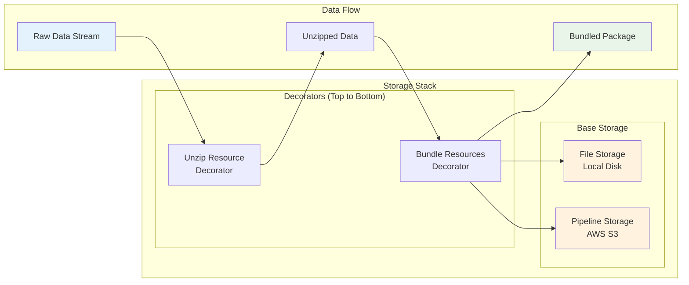

# Deployment Guide

## Overview

This comprehensive guide covers deploying OC Fetcher in production environments, from basic container deployment to enterprise-scale Kubernetes clusters. Learn how to configure, monitor, and scale your data fetching infrastructure.



*The diagram above shows the storage architecture and data flow, which is crucial for understanding production deployment requirements and scaling considerations.*

## What You'll Learn

This guide covers:
- **Production Requirements**: System requirements and dependencies
- **Environment Setup**: Configuration and credential management
- **Container Deployment**: Docker and Docker Compose setups
- **Kubernetes Deployment**: Production-ready K8s configurations
- **Monitoring & Observability**: Logging, metrics, and alerting
- **Security**: Best practices for production security
- **Scaling**: Performance optimization and horizontal scaling

## Quick Start

For immediate deployment, jump to [Environment Setup](#environment-setup). For comprehensive understanding, read through all sections.

## Production Requirements

### System Requirements

- **Python**: 3.9 or higher
- **Memory**: Minimum 4GB RAM (8GB+ recommended)
- **Storage**: Sufficient space for temporary files and logs
- **Network**: Stable internet connection for data fetching

### AWS Requirements

- **S3 Bucket**: For data storage
- **Secrets Manager**: For credential management
- **IAM Roles**: Appropriate permissions for S3 and Secrets Manager
- **CloudWatch**: For logging and monitoring (optional)

## Environment Setup

### Environment Variables

Set required environment variables:

```bash
# Storage Configuration
export OC_STORAGE_TYPE=s3
export OC_S3_BUCKET=your-production-bucket
export AWS_REGION=eu-west-2

# SQS Configuration (required for PipelineStorage)
export OC_SQS_QUEUE_URL=https://sqs.eu-west-2.amazonaws.com/123456789012/bundle-completions

# Credential Provider
export OC_CREDENTIAL_PROVIDER_TYPE=aws
export AWS_REGION=eu-west-2

# Logging
export OC_LOG_LEVEL=INFO
export OC_LOG_FORMAT=json

# Key-Value Store
export OC_KV_STORE_TYPE=redis
export OC_KV_STORE_REDIS_HOST=your-redis-host
export OC_KV_STORE_REDIS_PORT=6379
```

### AWS Credentials

Configure AWS credentials using one of these methods:

1. **AWS SSO** (recommended for development/ci):
   ```bash
   # Start the interactive AWS SSO configuration
   aws configure sso

   # During setup, provide:
   # - SSO session name: OpenCorporates-Management-Developer
   # - SSO start URL: https://d-9c671d0d67.awsapps.com/start
   # - SSO region: eu-west-2
   # - SSO registration scopes: sso:account:access (default)
   # - AWS account: Choose the management account (089449186373)
   # - Role: Choose the Developer role
   # - Default client region: eu-west-2
   # - CLI default output format: json
   # - Profile name: oc-management-dev (required for makefile compatibility)

   # Verify configuration
   aws sts get-caller-identity --profile oc-management-dev

   # Log in to AWS SSO (required before using AWS services)
   aws sso login --profile oc-management-dev
   ```

2. **IAM Role** (recommended for EC2):
   ```bash
   # No additional configuration needed if using IAM role
   ```

3. **AWS CLI Configuration** (legacy):
   ```bash
   aws configure
   ```

4. **Environment Variables** (not recommended for production):
   ```bash
   export AWS_ACCESS_KEY_ID=your-access-key
   export AWS_SECRET_ACCESS_KEY=your-secret-key
   ```

## Container Deployment

### Docker Deployment

Create a production Dockerfile:

```dockerfile
FROM python:3.9-slim

WORKDIR /app

# Install system dependencies
RUN apt-get update && apt-get install -y \
    gcc \
    && rm -rf /var/lib/apt/lists/*

# Install Poetry
RUN pip install poetry

# Copy project files
COPY pyproject.toml poetry.lock ./
COPY data_fetcher ./data_fetcher

# Install dependencies
RUN poetry config virtualenvs.create false \
    && poetry install --no-dev

# Set environment variables
ENV OC_STORAGE_TYPE=s3
ENV OC_LOG_LEVEL=INFO
ENV OC_LOG_FORMAT=json

# Run the application
CMD ["python", "-m", "data_fetcher_app.main"]
```

### Docker Compose

Create `docker-compose.prod.yml`:

```yaml
version: '3.8'

services:
  data-fetcher-app:
    build: .
    environment:
      - OC_STORAGE_TYPE=s3
      - OC_S3_BUCKET=${OC_S3_BUCKET}
      - AWS_REGION=${AWS_REGION}
      - OC_LOG_LEVEL=INFO
    volumes:
      - ./logs:/app/logs
    restart: unless-stopped
```

## Kubernetes Deployment

### Deployment Manifest

Create `k8s/deployment.yaml`:

```yaml
apiVersion: apps/v1
kind: Deployment
metadata:
  name: data-fetcher-app
spec:
  replicas: 1
  selector:
    matchLabels:
      app: data-fetcher-app
  template:
    metadata:
      labels:
        app: data-fetcher-app
    spec:
      containers:
      - name: data-fetcher-app
        image: data-fetcher-app:latest
        env:
        - name: OC_STORAGE_TYPE
          value: "s3"
        - name: OC_S3_BUCKET
          value: "your-production-bucket"
        - name: AWS_REGION
          value: "eu-west-2"
        - name: OC_LOG_LEVEL
          value: "INFO"
        resources:
          requests:
            memory: "2Gi"
            cpu: "500m"
          limits:
            memory: "4Gi"
            cpu: "1000m"
```

### Service Account

Create service account with appropriate IAM roles:

```yaml
apiVersion: v1
kind: ServiceAccount
metadata:
  name: data-fetcher-app-sa
  annotations:
    eks.amazonaws.com/role-arn: arn:aws:iam::ACCOUNT:role/data-fetcher-app-role
```

## Monitoring and Logging

### CloudWatch Logs

Configure structured logging to CloudWatch:

```python
import structlog
import boto3

# Configure CloudWatch logging
structlog.configure(
    processors=[
        structlog.stdlib.filter_by_level,
        structlog.stdlib.add_logger_name,
        structlog.stdlib.add_log_level,
        structlog.stdlib.PositionalArgumentsFormatter(),
        structlog.processors.TimeStamper(fmt="iso"),
        structlog.processors.StackInfoRenderer(),
        structlog.processors.format_exc_info,
        structlog.processors.UnicodeDecoder(),
        structlog.processors.JSONRenderer()
    ],
    context_class=dict,
    logger_factory=structlog.stdlib.LoggerFactory(),
    wrapper_class=structlog.stdlib.BoundLogger,
    cache_logger_on_first_use=True,
)
```

### Health Checks

Implement health check endpoint:

```python
from flask import Flask, jsonify

app = Flask(__name__)

@app.route('/health')
def health_check():
    return jsonify({
        'status': 'healthy',
        'timestamp': datetime.utcnow().isoformat()
    })

if __name__ == '__main__':
    app.run(host='0.0.0.0', port=8080)
```

## Security Considerations

### Network Security

- Use VPC for network isolation
- Configure security groups appropriately
- Use private subnets for internal communication

### Credential Management

- Store credentials in AWS Secrets Manager
- Use IAM roles instead of access keys
- Rotate credentials regularly

### Data Security

- Enable S3 bucket encryption
- Use TLS for all network communication
- Implement proper access controls

## Performance Tuning

### Resource Allocation

Monitor and adjust based on usage:

```yaml
resources:
  requests:
    memory: "2Gi"
    cpu: "500m"
  limits:
    memory: "4Gi"
    cpu: "1000m"
```

### Concurrency Settings

Adjust based on system capabilities:

```python
# In configuration
create_fetcher_config()
    .with_concurrency(4)  # Adjust based on CPU cores
    .with_timeout(30.0)   # Adjust based on network
```

## Backup and Recovery

### Data Backup

- Enable S3 versioning
- Configure cross-region replication
- Implement regular backup schedules

### Configuration Backup

- Store configurations in version control
- Use infrastructure as code
- Document all environment-specific settings

## Troubleshooting Production Issues

### Common Production Issues

1. **Memory Pressure**: Monitor memory usage and adjust limits
2. **Network Timeouts**: Increase timeout settings
3. **Rate Limiting**: Implement proper backoff strategies
4. **Storage Issues**: Monitor S3 quotas and performance

### Monitoring Tools

- **CloudWatch**: Metrics and logs
- **Prometheus**: Custom metrics
- **Grafana**: Visualization
- **AlertManager**: Alerting

## Scaling Considerations

### Horizontal Scaling

- Use multiple replicas in Kubernetes
- Implement proper load balancing
- Consider using queue-based architectures

### Vertical Scaling

- Monitor resource usage
- Adjust CPU and memory limits
- Optimize configuration settings

## See Also

### **Related Documentation**
- **[API Configurations](../configurations/fr_api.md)** - Deploying API-based configurations
- **[SFTP Configurations](../configurations/us_fl_sftp.md)** - Deploying SFTP configurations
- **[Application Configuration](../user_guide/application_configuration.md)** - Production configuration
- **[Storage Architecture](../architecture/storage/README.md)** - Production storage setup

### **Related Concepts**
- **[Architecture Overview](../architecture/README.md)** - Understanding deployment architecture
- **[Key-Value Store Configuration](../architecture/overview/README.md#key-value-store-configuration)** - Production caching and state management
- **[Testing Guide](../testing/overview.md)** - Pre-deployment testing

### **Examples and Tutorials**
- **[Basic Usage Example](https://github.com/openc/data-fetcher-sftp/blob/main/examples/basic_usage_example.py)** - Example application to deploy
- **[Credential Provider Example](https://github.com/openc/data-fetcher-sftp/blob/main/examples/credential_provider_example.py)** - Production authentication
- **[Troubleshooting Guide](../troubleshooting/troubleshooting_guide.md)** - Production issue resolution
