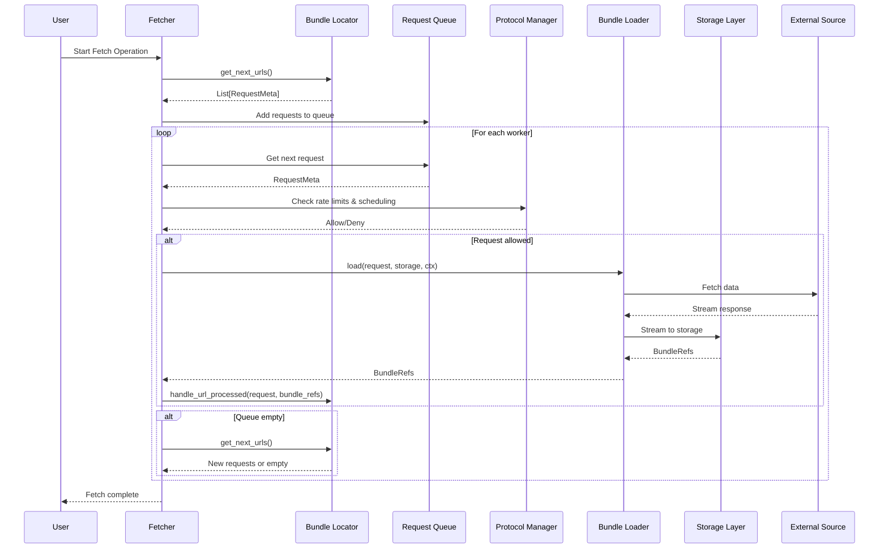

# Testing Guide

This guide covers testing the OC Fetcher framework, including test configuration, running tests, and best practices.

## Quick Start

For immediate testing setup:

```bash
# Run all tests
make test

# Run specific test categories
make test/unit           # Unit tests only
make test/integration    # Integration tests only
make test/functional     # Functional tests only

# Run with coverage
make test/with-coverage

# Run tests in parallel (faster)
make test/parallel
```

## What You'll Learn

This guide covers:
- **Test Execution**: Running tests with different configurations and options
- **Test Configuration**: Setting up test environments and dependencies
- **Writing Tests**: Creating unit, integration, and functional tests
- **Mock Services**: Using mock services for isolated testing
- **Debugging**: Troubleshooting test failures and performance issues
- **Best Practices**: Testing patterns and quality assurance



*The diagram above shows the data flow sequence in the framework, which is essential for understanding what components to test and how they interact.*

## Running Tests

### Basic Test Commands

```bash
# Run all tests
make test

# Run with verbose output
poetry run pytest -v

# Run specific test file
poetry run pytest tests/test_fetcher.py

# Run specific test
poetry run pytest tests/test_fetcher.py::TestFetcher::test_run_with_requests

# Run with coverage
make test/with-coverage
```

### Test Configuration

The project uses pytest with the following configuration:

- **asyncio_mode**: `auto` - Automatically detects and runs async tests
- **timeout**: 300 seconds - Default timeout for all tests
- **strict-markers**: Enabled - Ensures all test markers are registered
- **disable-warnings**: Enabled - Reduces noise in test output

## Test Structure

### Test Files

- `tests/test_unit/` - Unit tests for individual components
- `tests/test_integration/` - Integration tests for component interactions
- `tests/test_functional/` - End-to-end functional tests
- `mocks/test_cases/` - Test case configurations with input data and expected output
- `stubs/` - Mock services and type stubs for testing

### Test Cases Framework

The project includes a comprehensive test case framework for functional testing:

- **Test Case Discovery**: Automatically discovers and runs all test cases
- **Input/Output Validation**: Compares actual output with expected results
- **Mock Environment Management**: Automatically starts/stops mock services
- **Recipe-Specific Testing**: Supports both HTTP API and SFTP recipes
- **Flexible Comparison**: Validates structure, content, and metadata

For detailed information, see [Test Cases Framework](test_cases_framework.md).

### Test Markers

```python
@pytest.mark.asyncio          # Mark test as async
@pytest.mark.localstack      # Mark test as requiring localstack container
@pytest.mark.integration     # Mark test as integration test
@pytest.mark.slow           # Mark test as slow-running
```

## Graceful Shutdown Handling

The test configuration includes proper handling of Ctrl-C interruptions:

- **Signal Handlers**: Proper handling of SIGINT and SIGTERM signals
- **Custom Exception Handler**: Filters out I/O errors during shutdown
- **Task Cleanup**: Automatically cancels and waits for pending tasks
- **Immediate Termination**: Tests stop immediately when Ctrl-C is pressed

## Mock Services

### LocalStack for AWS Testing

Some tests require AWS services. Use LocalStack for local testing:

```bash
# Start LocalStack
docker-compose -f stubs/docker-compose.yml up -d

# Run tests that require LocalStack
poetry run pytest -m localstack

# Stop LocalStack
docker-compose -f stubs/docker-compose.yml down
```

### Mock API Server

For API testing, a mock Sirene API server is provided:

```bash
# Start mock Sirene API server
cd mocks/api_fr_siren
docker build -t siren_api_mock .
docker run -p 5000:5000 siren_api_mock

# Run API tests (mock is automatically started by test fixtures)
poetry run pytest tests/test_functional/test_fr.py
```

## Dependencies

The following testing dependencies are included:

- `pytest`: Core testing framework
- `pytest-asyncio`: Async test support
- `pytest-timeout`: Test timeout support
- `coverage`: Code coverage reporting
- `testcontainers`: Container-based testing
- `mypy`: Type checking
- `ruff`: Code formatting and linting

## Best Practices

### Test Organization

1. **Group related tests** in the same file
2. **Use descriptive test names** that explain what is being tested
3. **Keep tests independent** - each test should be able to run alone
4. **Use appropriate assertions** - be specific about what you're testing

### Test Data

1. **Use minimal test data** - only include what's necessary
2. **Make test data deterministic** - avoid random values
3. **Clean up after tests** - use fixtures for setup/teardown
4. **Document test data** - explain what the data represents

### Performance

1. **Keep tests fast** - avoid unnecessary delays
2. **Use mocks** for external dependencies
3. **Mark slow tests** appropriately
4. **Monitor test execution time** regularly

### Retry Logic Testing

The framework uses a unified retry system for protocol managers. When testing components that use retry logic:

1. **Test retry behavior**: Verify that retries work as expected
2. **Mock retry scenarios**: Test both success and failure cases
3. **Test timeout handling**: Ensure tests don't hang on retry loops
4. **Use appropriate timeouts**: Set reasonable timeouts for retry tests

For more details on the retry system, see [Retry Consolidation Summary](../references/retry_consolidation_summary.md).

### General Testing Guidelines

1. **Use Async Tests**: Mark async tests with `@pytest.mark.asyncio`
2. **Mock External Dependencies**: Use mocks for external services
3. **Test Timeouts**: Long-running tests should have appropriate timeouts
4. **Clean Up Resources**: Ensure proper cleanup in test fixtures
5. **Handle Interruptions**: Tests should handle Ctrl-C gracefully

## See Also

### **Related Documentation**
- **[Writing Tests](writing_tests.md)** - Comprehensive guide to writing tests
- **[Test Cases Framework](test_cases_framework.md)** - Test case framework and structure
- **[Mock Services](mock_services.md)** - Mock services and test fixtures
- **[Mock Environments](mock_environments/README.md)** - Mock environment setup and usage
- **[Debugging Tests](debugging_tests.md)** - Debugging and troubleshooting
- **[Fetcher Recipes](../configurations/creating_configuration.md)** - Testing custom fetcher recipes
- **[User Guide](../user_guide/getting_started.md)** - Basic usage and testing
- **[Deployment Guide](../deployment/overview.md)** - Production testing and validation

### **Related Concepts**
- **[Architecture Documentation](../architecture/README.md)** - Understanding components to test
- **[Contributing Guide](../contributing/contributing_guide.md)** - Development and testing workflow
- **[Code Standards](../contributing/code_standards.md)** - Testing code quality standards

### **Examples and Tutorials**
- **[Basic Usage Example](https://github.com/openc/data-fetcher-sftp/blob/main/examples/basic_usage_example.py)** - Example code to test
- **[Credential Provider Example](https://github.com/openc/data-fetcher-sftp/blob/main/examples/credential_provider_example.py)** - Authentication testing
- **[Troubleshooting Guide](../troubleshooting/troubleshooting_guide.md)** - Debugging test failures
